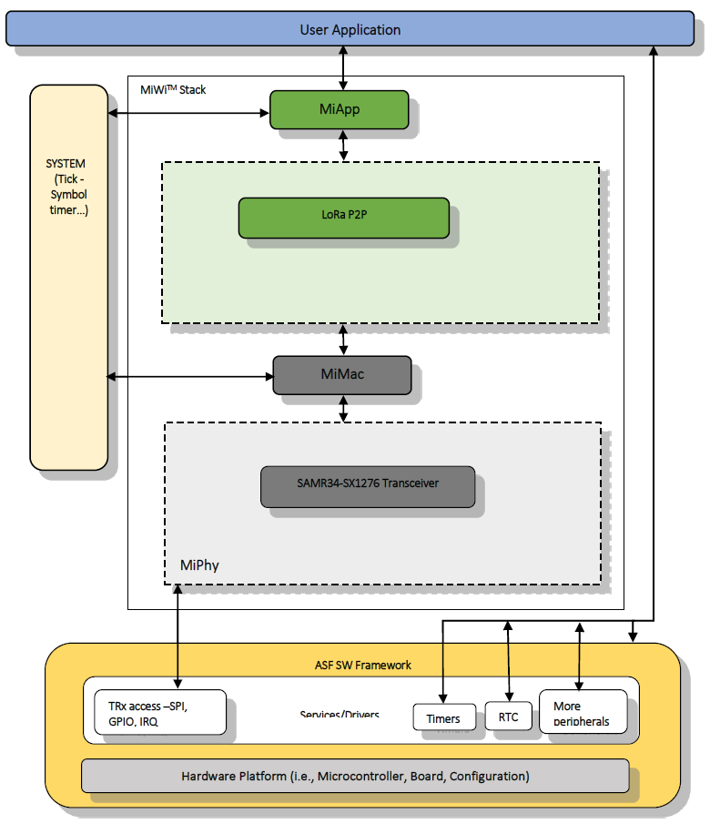
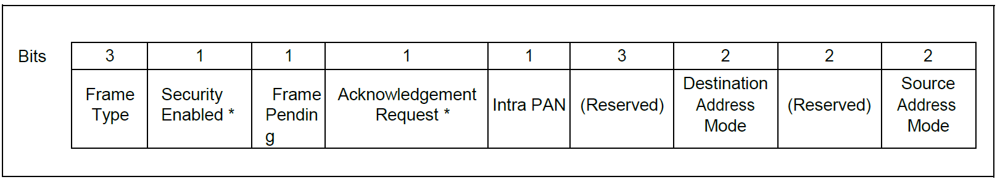
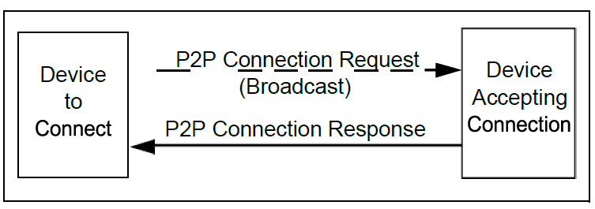
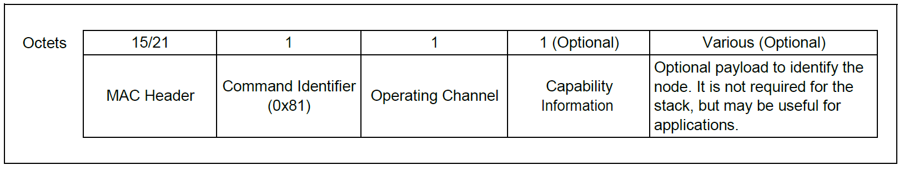
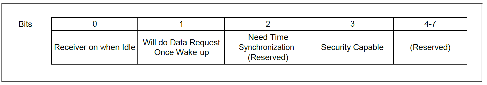
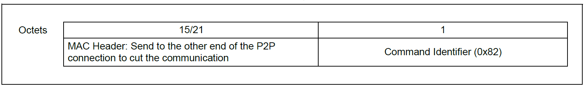
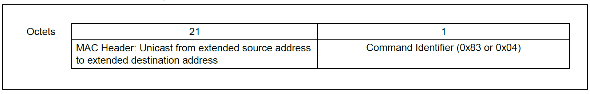
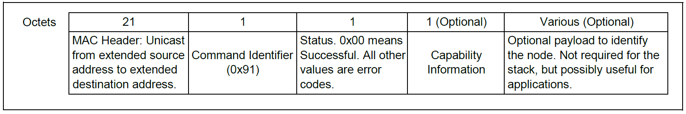
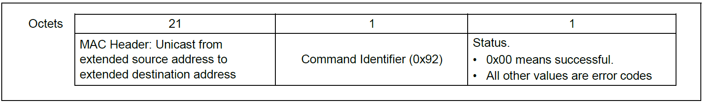

# Learning Phase
> "Wireless Made Easy!" - Enable Easy to use P2P Protocol for Long-Range & Low Power Applications on SAM R34 LoRa Technology ICs and WLR089U0 Module

[Back to Main page](../README.md#top)

## A la carte

1. [Introduction](#step1)
1. [Protocol Overview](#step2)
      1. [Protocol Features](#step2a)
      1. [Protocol Considerations](#step2b)
   1. [Acronyms and Abbreviations](#step3)
   1. [Architecture](#step4)
   1. [LoRa P2P Wireless Protocol](#step5)
      1. [PHY Layer](#step5a)
      1. [Device Types](#step5b)
      1. [Supported Topology](#step5c)
      1. [Network Types](#step5d)
      1. [Network Addressing](#step5e)
   1. [Message Format](#step6)
      1. [Frame Format](#step6a)
      1. [Transmitting and Receiving](#step6b)
   1. [Variations for Handshaking](#step7)
   1. [Custom MAC Commands for LoRa P2P Wireless Protocol](#step8)
      1. [P2P Connection Request](#step8a)
      1. [P2P Connection Removal Request](#step8b)
      1. [Data Request](#step8c)
      1. [P2P Connection Response](#step8d)
      1. [P2P Connection Removal Response](#step8e)
   1. [LoRa P2P Wireless Protocol's Unique Features](#step9)
   1. [Network Freezer](#step10)
      1. [Motivation](#step10a)
      1. [Solution](#step10b)
      1. [Interface](#step10c)
      1. [Additional Notes](#step10d)
   1. [Sleep Feature](#step11)
   1. [LoRa P2P - Networking](#step12)
      1. [Start and Join Network](#step12a)
      1. [Data Transfer in Network](#step12b)
   1. [MACRO Description for LoRa P2P](#step13)
   1. [MiApp API List](#step14)
   1. [MiApp API Description](#step15)
   1. [Limitations](#step16)

## Introduction

The demand is growing for more and more applications to move to wireless communication.

The benefits are reduced costs and ease of implementation. Wireless communication does not require cabling and other hardware, and the associated installation costs. It also can be implemented in locations where cabling would be hard, if not impossible, to install.

MiWi stack applies to low data rate applications with low-power and low-cost requirements. With the advantage of long range transceiver support provided by the LoRa transceivers, we are combining the advantage of both the MiWi stack and Long range support by this LoRa P2P protocol.

<b>
The Microchip LoRa P2P Wireless Protocol is a variation of MiWi Stack, using exclusively Microchip SAM R34 LoRa Technology ICs and WLR089U0 Module. The LoRa P2P Wireless Protocol is not compatible with the others MiWi Stacks.

</b>

The protocol provides reliable direct wireless communication via an easy-to-use programming interface. It has a rich feature set that can be compiled in and out of the stack to meet a wide range of application needs – while minimizing the stack footprint.

This guide describes the Microchip Wireless LoRa Peer-to-Peer (P2P) Protocol and usage of the LoRa transceiver modulation and channel support. The present documentation details the supported features and how to implement them. Simple, application-level data structures and programming interfaces also are described.

This assumes that readers know C programming. It is strongly recommended that readers review the LoRa Transceiver operations before starting this application note or working with the LoRa P2P wireless protocol.

This guide provides all the information needed for a developer to understand the LoRa P2P applications implemented on Microchip LoRa P2P Protocol available in SAM R34 family composed of SAM R34 ICs and WLR089U0 Module.

## Protocol Overview

The LoRa P2P implementation is based on the MiWi Protocol that has the simple handshaking process and the support for LoRa transceiver Chirp modulation in the Physical Layer. The MAC Layer modifications available in the MiWi simplifies link disconnection and channel hopping by providing supplementary MAC commands. The Physical layer support is provided through the LoRa Transceiver which supports the Chirp modulation.

However, application-specific decisions, such as when to perform an energy detect scan or when to jump channels, are not defined in the protocol and they are left to the application developer.

### Protocol Features

The LoRa P2P Wireless Protocol:

- Provides 26 channels in the 862 MHz to 1020 MHz spectrum (using an SAMR34/SX1276 transceiver)
- Supported in Atmel Studio 7.0 IDE
- Functions as a state machine (not RTOS-dependent)
- Supports a sleeping device at the end of the communication
- Enables Energy Detect (ED) scanning to operate on the least-noisy channel
- Provides active scan for detecting existing connections
- Secured unicast data communication
- Enables frequency agility (channel hopping)

### Protocol Considerations

- The MiWi P2P protocol is a variation of IEEE 802.15.4 and supports peer-to-peer topology. It has no routing mechanism, so the wireless communication coverage is defined by the radio range.
- Guaranteed Time Slot (GTS) and beacon networks are not supported, so both sides of the communication cannot go to sleep at the same time.
- Currently LoRa P2P supports only LoRa Modulation based packets.

## Acronyms and Abbreviations

| Acronym/Abbreviation | Description                                          |
| -------------------- | ---------------------------------------------------- |
| P2P                  | Peer to Peer                                         |
| MAC                  | Medium Access Control Layer                          |
| PAN                  | Personal Area Network                                |
| PANC / PAN Coordinator | Personal Area Network Coordinator (non-sleeping device)                  |
| Coord                | Coordinator                                          |
| ED                   | End Device                                           |
| SED                  | Sleeping End Device                                  |
| RFD                  | Reduced Function Device (Sleeping End Device)                            |
| FFD                  | Full Function Device (PAN Coordinator)                               |
| LQI                  | Link Quality Index                                   |
| Ack                  | Acknowledgement                                      |
| LBT                  | Listen Before Talk                                   |

## Architecture

Architecture of the LoRa P2P is based on the MiWiTM Protocol on ASF, which supports additional features for the application developer to pull in required components, services and drivers from ASF Wizard.\
More details on - [http://www.microchip.com/webdoc/asf/asf.ModuleExplorerView.html](http://www.microchip.com/webdoc/asf/asf.ModuleExplorerView.html)

## LoRa P2P Wireless Protocol

### PHY Layer

The SAMR34 and WLR089U0 devices have the SX1276 radio operates on the 137 MHz to 1020 MHz Low Power Long Range Transceiver. That spectrum has been classified as 26 channels operating between 862 MHz – 1020 MHz. The maximum packet length depends on the factors of LoRa transceiver such as spreading factor and Bandwidth.

### Device Types

The LoRa P2P protocol categorizes devices based on their role in making the communication connections.

The LoRa P2P stack supports all of these device types based on functionality:

| Functional Type | Power Source | Received Idle Configuration | Data Reception Method
| --------------- | ------------ | --------------------------- | ----------- | 
| Full Function Device (FFD) | Mains | On | Direct |
| Reduced Funtion Device (RFD) | Battery | Off | Poll from the associated device |
 
The LoRa P2P stack supports all of these device types based on role:

| Role Type | Functional Type | Role Description |
| --------- | --------------- | ---------------- |
| Personal Area Network (PAN) Coordinator | FFD | The device starts first and waits for a connection |
| End Device | FFD or RFD | The device starts after the PAN coordinator has started to establish a connection |

### Supported Topology

**Current LoRa P2P stack support only Peer-to-Peer topology.**

### Network Types

There are two types of networks: beacon and non-beacon:

- In a beacon network, devices can transmit data only during their assigned time slot. The PAN coordinator assigns the time slots by periodically sending out information in beacon frame. All devices are supposed to synchronize with the beacon frame and transmit data only during their assigned time slot.

- In a non-beacon network, any device can transmit data at any time, as long as the energy level (noise) is below the predefined level.

**The LoRa P2P stack supports only non-beacon networks.**

### Network Addressing

There are two types of addressing mechanisms:
- Extended Organizationally Unique Identifier (EUI) or long address – An eight-byte address that is unique for each device, worldwide.
The upper three bytes are purchased from IEEE by the company that releases the product. The lower five bytes are assigned by the device manufacturer as long as each device’s full EUI is unique.
- Short Address – A two-byte address that is assigned to the device by its parent when it joins the network.\
The short address must be unique within the network.

The LoRa P2P stack supports only one-hop communication, so it transmits messages via EUI or long address addressing. Short addressing (0xFFFF) is used only when the stack transmits a broadcast message. This is because there is no predefined broadcast long address.

## Message Format

### Frame Format

The message format of the LoRa P2P stack is:

#### Frame Control

The three-bit frame type field defines the type of packet. The values can be:
- Data frame = 001
- Acknowledgement = 010
- Command frame = 011

**In the stack, the Acknowledgement frame is not used and not supported for effective utilization of bandwidth.**\
Developer can have the application level acknowledgement if required.

The security enabled bit indicates if the current packet is encrypted. Security support is provided in the LoRa P2P for Data packets.

The intra PAN bit indicates if the message is within the current PAN. If this bit is set to ‘1’, the source PAN ID field in the addressing fields will be omitted. In the stack, this bit is always set to ‘1’, but it could be set to ‘0’ to enable inter-PAN communication. Resetting the bit to ‘0’ can be done in the application layer, if necessary.

The Destination Address mode can be either:
- 16-Bit Short Address mode = 10
- 64-Bit Long Address mode = 11

In the LoRa P2P stack, the Destination Address mode is usually set to the Long Address mode. The Short Address mode is used only for a broadcast message. For broadcast messages, the destination address field in the addressing fields will be fixed to 0xFFFF.

The Source Address mode for the LoRa P2P stack can only be the 64-Bit Long Address mode.

#### Sequence Number

The sequence number is eight bits long. It starts with a random number and increases by one each time a data or command packet has been sent.

#### Destination PAN ID

This is the PAN identifier for the destination device. If the PAN identifier is not known, or not required, the broadcast PAN identifier (0xFFFF) can be used.

#### Destination Address

The destination address can either be a 64-bit long address or a 16-bit short address. The destination address must be consistent with the Destination Address mode defined in the frame control field.
If the 16-bit short address is used, it must be the broadcast address of 0xFFFF.

#### Source PAN ID

The source PAN identifier is the PAN identifier for the source device and must match the intra-PAN definition in the frame control field. The source PAN ID will exist in the packet only if the intra-PAN value is ‘0’.

In the current LoRa P2P stack implementation, all communication is intra-PAN. As a result, all packets do not have a source PAN ID field.

However, the stack reserves the capability for the application layer to transmit the message inter-PAN. If a message needs to transmit inter-PAN, the source PAN ID will be used.

#### Source Address

The source address field is fixed to use the 64-bit extended address of the source device.

### Transmitting and Receiving

The LoRa P2P stack transmits and receives packets thus it support bi-directional communication. 

#### Transmitting Messages

There are two ways to transmit a message: broadcast and unicast.

Broadcast packets have all devices in the radio range as their destination. There is no long address defined for the broadcast purpose. As a result, broadcasting is the only situation when the LoRa P2P stack uses a short address.

Unicast transmissions have only one destination and use the long address as the destination address. Unicast data communications have the Acknowledgement support in the LoRa P2P.

If the transmitting device has at least one device that turns off its radio when Idle, the transmitting device will save the message in RAM and wait for the sleeping device to wake-up and request the message. This kind of data transmitting is called indirect messaging.

If the sleeping device fails to acquire the indirect message, it will expire and be discarded. Usually, the indirect message time-out needs to be longer than the polling interval for the sleeping device.

Secured data communication can be enabled using the `#define ENABLE_SECURITY` in `miwi_config.h` and the security keys can be provided in the `SECURITY_KEY_xx` values in `phy.h`.

For acknowledgement based data communication, the acknowledgment timeout shall be configured using the `#define ACK_TIMEOUT_INTERVAL` in `miwi_config.h` and also the number of times the packet shall be retried for successful communication shall be configured in `#define DATA_RETRY_ATTEMPT` as well in `miwi_config.h`

#### Receiving Messages

In the LoRa P2P stack, only the messaged device will be notified by the radio. If the messaged device turns off its radio when Idle, it can only receive a message from the device to which it is connected.

For the idling device with the turned off radio to receive the message, the device must send a data request command to its connection peer. Then, it will acquire the indirect message if there is one or it will receive the empty data.

## Variations for Handshaking

The Microchip LoRa P2P Wireless Protocol’s has a specific handshaking process.

Handshaking is the complex process of joining a network. A device can join only a single device as its parent, so the initial handshaking actually is the process of choosing a parent.

Choosing the parent requires:
- Listing all of the possible parents.
- Choosing the right one as its parent.

The LoRa P2P protocol is designed for simplicity and direct connections in P2P communication topology. The LoRa P2P protocol uses its own, two-step handshaking process. 

In that process:
- The initiating device sends out a P2P connection request command.
- Any device within radio range responds with a P2P connection response command that finalizes the connection.

This is a one-to-many process that may establish multiple connections, where possible, to establish a Peer-to-Peer topology. Since this handshaking process uses a MAC layer command, based on the region of support Listen Before Talk (LBT) restriction is applied for each transmission. **Only LBT is supported in the LoRa P2P package.**

RFDs may receive the Connection Request command from several FFDs, but can connect to only one FFD. An RFD chooses the FFD, from which it receives the first P2P connection response, as its peer.

## Custom MAC Commands for LoRa P2P Wireless Protocol

The LoRa P2P protocol uses custom MAC commands for removing the connection between two devices. All of the protocol’s custom MAC commands are listed here.

| Command Identifier | Command Name | Description |
| ------------------ | ------------ | ----------- |
| 0x81 | P2P Connection Request | Request to establish a P2P connection. Usually broadcast to seek P2P connection after powering up. Alternately, unicast to seek an individual connection. Alse used for active scan functionality |
| 0x82 | P2P Connection Removal Request | Removes the P2P connection with the other end device |
| 0x83 | Data Request | Similar to the IEEE 802.15.4™ specification’s data request command, a request for data from the other end of a P2P connection if the local node had its radio turned off. Reserved for the previously sleeping device to request the other node to send the missed message (indirect messaging). |
| 0x84 | Channel Hopping | Request to change operating channel to a different channel. Usually used in the feature of frequency agility. |
| 0x91 | P2P Connection Response | Response to the P2P connection request. Also can be used in active scan process. |
| 0x92 | P2P Connection Removal Response | Response to the P2P connection removal request |

### P2P Connection Request

The P2P connection request (0x81) is broadcasted to establish a P2P connection with other devices after powering up. The request can also be unicast to a specific device to establish a single connection.

When the transmitting device receives a P2P connection response (0x91) from the other end, a P2P connection is established.

The P2P connection request custom command can also start an active scan which is done to determine what devices are available in the neighborhood.

When a P2P connection request command is sent out for active scan purposes, the capability information and optional payload will not be attached. The receiving device uses the attachment, or absence of capability information, and an optional payload to determine if the command is a request to establish a connection or just an active scan.

The LoRa P2P stack can enable or disable a device to allow other devices to establish connections. Once a device is disabled from making connections, any new P2P connection request will be discarded, except under the following conditions:
- The P2P connection request is coming from a device with which the receiving end already has had an established connection.
- The P2P connection request is an active scan.

The format of the P2P connection request command frame is:

The operating channel is used to bypass the effect of subharmonics that may come from another channel. It will avoid the false connections with devices that operate on different channels.

The optional capability information byte is formatted as below:

The P2P connection request’s optional payload is provided for specific applications. A device may need additional information to identify itself either its unique identifier or information about its capabilities in the application. With the optional payload, no additional packets are required to introduce or identify the device after the connection is established.

The optional payload will not be used in the stack itself.

### P2P Connection Removal Request

The P2P connection removal request (0x82) is sent to the other end of the connection to remove the P2P connection. 

The connection removal request format is provided below.

### Data Request

The data request (0x83) command is the same as the IEEE 802.15.4 specification’s data request (0x04) command.

If one side of a P2P connection node is able to Sleep when Idle, and that node could receive a message while in Sleep, the always active side of the connection must store the message in its RAM. The always active side delivers the message when the sleeping device wakes up and requests the message.

If an application involves such conditions, the feature `ENABLE_INDIRECT_MESSAGE` in `miwi_config.h` needs to be activated. The sleeping node must send the data request command after it wakes up.

### P2P Connection Response

The P2P connection response (0x91) command is used to respond to the P2P connection request.

The P2P connection response command can be used to establish a connection. Alternately, the command can be used by a device responding to an active scan, identifying itself as active in the neighborhood.

If the P2P connection request command that was received had a capability information byte and an optional payload attached, it is requesting a connection. The capability information and optional payload, if any, would be attached to the P2P connection response.

The format of the response’s capability information is described [here](#step1ga).

The optional payload is provided for specific applications. Its format and usage is the same as the optional payload attached to P2P connection request command.

### P2P Connection Removal Response

The P2P connection removal response command (0x92) is used to respond to the P2P connection removal request. It notifies the other end of the P2P connection that a P2P connection request had been received early and whether the resulting connection has been removed.

## LoRa P2P Wireless Protocol's Unique Features

The LoRa P2P protocol supports a reduced functionality, point-to-point, direct connection and a rich set of features. All features can be enabled or disabled and compiled in and out of the stack, according to the needs of the wireless application.

This section describes the unique features of the LoRa P2P protocol. They include:
- Small programming size
- Support for Idle devices to turn off radio
- Indirect messaging
- Active scan for finding existing networks on different channels
- Energy scan for finding the channel with the least noise
- Simplified connection process
- Secured unicast data communication
- Unicast acknowledgment and data retry for communication failure

## Network Freezer

### Motivation

Occasionally, a wireless network may lose power. After power is restored, in most of the cases, the wireless nodes might form a different network through different joining procedures. After the power cycle, a wireless node in LoRa P2P network may be assigned with a different network address. As the result, the application layer may have to dedicate more efforts to handle the power cycle scenario. It is important to develop a feature which can release the application layer from handling power cycle.

Additionally, the persistent data fields maintained by the stack during run-time need to be updated “individually” several times during run-time. However, such an update to a “fixed address” in flash would require a full “backup-erase-re-write” cycle on the entire row that the field belongs to due to flash device requirements:

- With write granularity being a page (64 byte), any valid write operation assumes that the entire page is pre-erased to all 0xFFs.
- The erase granularity is row (256 bytes). So even if we want to update within one page, we will need to perform the “back-erase-write” on the entire row unless we know it is pre-erased.

### Solution

Network Freezer feature is developed to solve this problem. It saves critical network information into the Non-Volatile Memory (NVM) and restore them after power cycle. In this way, the application does not need to worry about the power cycle scenario and the network can be restored to the state before the power cycle without many message exchanges after the power cycle.

Additionally, Wear-levelling (`PDS_ENABLE_WEAR_LEVELING` defined in symbols) implementation is aimed at drastically reducing the number of such “backup-erase-re-write” cycles and thereby improving the flash life-time.

### Interface

Network Freezer feature can be enabled by defining `ENABLE_NETWORK_FREEZER` in symbols of application project.

Network Freezer feature is invoked by calling the MiApp function `MiApp_ProtocolInit`. 

When Network Freezer is enabled in the application, the network information will be restored from NVM; otherwise, the network information in NVM will be erased and the wireless node start from scratch.

### Additional Notes

Network Freezer feature requires NVM to store the critical network information. Currently NVM used for this implementation is internal Flash.

## Sleep Feature

For most of the applications, it is critical to provide long battery life for the sleeping devices. A device can be either in active mode or sleep mode. After being powered up, a node always starts in active mode, with its MCU fully turned on.

In sleep mode, the RF chip and the MCU are in low power states and only the functionality required for MCU wake ups remains active. Thus, the application cannot perform any radio Tx/Rx operations, communicate with external periphery, in sleep mode.

A majority portion of power is consumed when the sleeping device is active, asking for data and sending data in the duty cycle. So, device to be active is based on its polling period which defined by the `RFD_WAKEUP_INTERVAL` (defined `miwi_config.h`). This can be controlled in configuration option. Among all nodes, only end devices can sleep.

Sleep feature can be enabled by defining `ENABLE_SLEEP_FEATURE` in project symbols of application.

## LoRa P2P - Networking

Microchip LoRa P2P network is provided with features categorized as follows…

1. Start and Join Network
2. Data Transfer in Network

### Start and Join Network

1. On device reset based on the network freezer configuration the device will fetch the previous network informations or start from the scratch.
2. `MiApp_ProtocolInit` function initializes the address and required parameters for the device.
3. Based on the configurations provided in the MiWi Configuration header file (`miwi_config.h`) , the device will perform the energy detection if `ENABLE_ED_SCAN` is enabled and then perform the active scan for available networks if `ENABLE_ACTIVE_SCAN` is enabled.
4. If no device is available nearby it will initiate the device start process and be active for any other device connect request.
5. Based on the selected channel and device address the device will initiate the connection process with the connection request.
6. Connection response will be provided from the intended device to make the connection and the connection details will be stored in the connection table.
7. The status of connection and connection table details will be displayed in the serial console and the LCD interface if enabled.

### Data Transfer in Network

1. Data transfer can be imitated with the `MiApp_SendData` function which provides the option to initiate the data transfer based on the device details available in the connection table.
2. The unicast data transfer will be based on the IEEE address stored in the connection table and broadcast data will be delivered to all devices in the network with the broadcast short address (0xFFFF).
3. Data conformation callback provided in the `MiApp_SendData` function will be invoked on the device which initiates the data transfer.
4. In the receiving device the data indication will be provided based on the callback registered through the function `MiApp_SubscribeDataIndicationCallback`

## MACRO Description for LoRa P2P

### FULL_CHANNEL_MAP

| Description | Channel map is a bit map used to select |
| ----------- | --------------------------------------- |
| **Default value** | 1 |
| **Range** | Bitmap based on the physical layer. Set/Clear of any bits in the below range is valid... SAMR34 - 0x04FFFFF (for SAMR34 (0-25))|
| **Memory usage** | None |
| **Configurable in** | `mimac.h` |
| **Remarks** | Configure all band support in the project symbols   AS_BAND=1 AU_BAND=1 IND_BAND=1 JPN_BAND=1 KR_BAND=1 NA_BAND=1 EU_BAND=1 |

### CONNECTION_SIZE

| Description | Defines the maximum P2P connections that the device is capable at the same time |
| ----------- | --------------------------------------- |
| **Default Value** | 5
| **Range** | 1 - 65535 |
| **Memory Usage** | None |
| **Configurable in** | `miwi_config.h` |
| **Remarks**| |

### ENNABLE_HAND_SHAKE

| Description | `ENABLE_HAND_SHAKE` enables the protocol stack to hand-shake before communicating with each other. Without a handshake process, RF transceivers can only broadcast, or hardcoded the destination address to perform unicast. |
| ----------- | --------------------------------------- |
| **Default value** | Enabled |
| **Range** | Enable / Disable |
| **Memory Usage** | None |
| **Configurable in** | `miwi_config.h` |
| **Remarks** | |

### ENABLE_ED_SCAN

| Description | `ENABLE_ED_SCAN` will enable the device to do an energy detection scan to find out the channel with least noise and operate on that channel |
| ----------- | --------------------------------------- |
| **Default value** | Disabled |
| **Range** | Enable / Disable |
| **Memory Usage** | None |
| **Configurable in** | `miwi_config.h` |
| **Remarks** | |

### ENABLE_ACTIVE_SCAN

| Description | `ENABLE_ACTIVE_SCAN` will enable the device to do an active scan to detect current existing connection. |
| ----------- | --------------------------------------- |
| **Default value** | Disabled |
| **Range** | Enable / Disable |
| **Memory Usage** | None |
| **Configurable in** | `miwi_config.h` |
| **Remarks** | |

### ENABLE_SECURITY

| Description | `ENABLE_SECURITY` will enable the device to perform the secured data communication. |
| ----------- | --------------------------------------- |
| **Default value** | Disabled |
| **Range** | Enable / Disable |
| **Memory Usage** | None |
| **Configurable in** | `miwi_config.h` |
| **Remarks** | |

### ACK_TIMEOUT_INTERVAL

| Description | `ACK_TIMEOUT_INTERVAL` defines acknowledgment packet waiting time for the transmitted data for FFDs in second. |
| ----------- | --------------------------------------- |
| **Default value** | 1 |
| **Range** | - |
| **Memory Usage** | None |
| **Configurable in** | `miwi_config.h` |
| **Remarks** | |

### RFD_WAKEUP_INTERVAL

| Description | `RFD_WAKEUP_INTERVAL` defines the wake up interval for RFDs in second. This definition is for the FFD devices to calculated various timeout. RFD depends on the setting of the watchdog timer to wake up, thus this definition is not used. |
| ----------- | --------------------------------------- |
| **Default value** | 8 |
| **Range** | - |
| **Memory Usage** | None |
| **Configurable in** | `miwi_config.h` |
| **Remarks** | |

### RFD_DATA_WAIT

| Description | `RFD_DATA_WAIT` is the timeout defined for sleeping device to receive a message from the associate device after Data Request. After this timeout, the RFD device can continue to operate and then go to sleep to conserve battery power. |
| ----------- | --------------------------------------- |
| **Default value** | 0x000FFFFF |
| **Range** | 0 - 0xFFFFFFFF |
| **Memory Usage** | None |
| **Configurable in** | `miwi_config_p2p.h` |
| **Remarks** | |

### DATA_RETRY_ATTEMPT

| Description | `DATA_RETRY_ATTEMPT` is the maximum time that the wireless node can retry to make the successful communication. Once the retry times are exhausted control will be return to application layer as failed communication to decide what to do next. |
| ----------- | --------------------------------------- |
| **Default value** | 3 |
| **Range** | 0 - 0xFF |
| **Memory Usage** | None |
| **Configurable in** | `miwi_config_p2p.h` |
| **Remarks** | |

### CONNECTION_RETRY_TIMES

| Description | `CONNECTION_RETRY_TIMES` is the maximum time that the wireless node can try to establish a connection. Once the retry times are exhausted control will be return to application layer to decide what to do next |
| ----------- | --------------------------------------- |
| **Default value** | 3 |
| **Range** | 0 - 0xFF |
| **Memory Usage** | None |
| **Configurable in** | `miwi_config_p2p.h` |
| **Remarks** | |

### CONNECTION_INTERVAL

| Description | `CONNECTION_INTERVAL` defines the interval in second between two connection requests |
| ----------- | --------------------------------------- |
| **Default value** | 4 |
| **Range** | - |
| **Memory Usage** | None |
| **Configurable in** | `miwi_config_p2p.h` |
| **Remarks** | |

### ACTIVE_SCAN_RESULT_SIZE

| Description | `ACTIVE_SCAN_RESULT_SIZE` defines the maximum active scan result that the stack can hold. If active scan responses received exceed the definition of `ACTIVE_SCAN_RESULT_SIZE`, those later active scan responses will be discarded |
| ----------- | --------------------------------------- |
| **Default value** | 4 |
| **Range** | - |
| **Memory Usage** | None |
| **Configurable in** | `miwi_config_p2p.h` |
| **Remarks** | |

### INDIRECT_MESSAGE_SIZE

| Description | `INDIRECT_MESSAGE_SIZE` defines the maximum number of packets that the device can store for the sleeping device(s) |
| ----------- | --------------------------------------- |
| **Default value** | 2 |
| **Range** | 0 - 0xFF |
| **Memory Usage** | None |
| **Configurable in** | `miwi_config_p2p.h` |
| **Remarks** | |

### ENABLE_NETWORK_FREEZER / PDS_ENABLE_WEAR_LEVELING

| Description | Enable the network freezer functionality to store important parameters along with the wear leveling |
| ----------- | --------------------------------------- |
| **Default value** | Disabled |
| **Range** | Enable / Disable |
| **Memory Usage** | None |
| **Configurable in** | Project Symbols |
| **Remarks** | |

### ENABLE_SLEEP_FEATURE

| Description | Enable the sleep functionality for the device |
| ----------- | --------------------------------------- |
| **Default value** | Disabled |
| **Range** | Enable / Disable |
| **Memory Usage** | None |
| **Configurable in** | Project Symbols |
| **Remarks** | |

> Note:
* `RADIO_SetAttr` function can be used to set any LoRa Transceiver parameters. By default SF7 is configured after initialization.
* `RADIO_GetAttr` function can be used to get and validate LoRa Transceiver parameters.

## `MiApp` API List

The following table lists the supported APIs.

Function Prototype : `miwi_p2p.h`\
Function definitions : `miwi_p2p.c`

| No. | Supported APIs |
| --- | -------------- |
| 1 | `miwi_status_t MiApp_ProtocolInit (defaultParametersRomOrRam_t *defaultRomOrRamParams, defaultParametersRamOnly_t *defaultRamOnlyParams)` |
| 2 | `bool MiApp_Set(enum id, uint8_t value )` |
| 3 | `bool MiApp_StartConnection (uint8_t Mode, uint8_t ScanDuration, uint32_t ChannelMap, FUNC ConfCallback)` |
| 4 | `uint8_t MiApp_SearchConnection(uint8_t ScanDuration, uint32_t ChannelMap, FUNC ConfCallback)` |
| 5 | `uint8_t MiApp_EstablishConnection(uint8_t Channel, uint8_t addr_len, uint8_t addr, uint8_t Capability_info, FUNC ConfCallback)` |
| 6 | `void MiApp_RemoveConnection(uint8_t ConnectionIndex)` |
| 7 | `void MiApp_ConnectionMode(uint8_t Mode)` |
| 8 | `MiApp_SendData(uint8_t addr_len, uint8_t addr, uint8_t len, uint8_t pointer, FUNC ConfCallback) ` |
| 9 | `MiApp_SubscribeDataIndicationCallback(FUNC callback)` |
| 10 | `uint8_t MiApp_NoiseDetection(uint32_t ChannelMap, uint8_t ScanDuration, uint8_t DetectionMode, OUTPUT uint8_t NoiseLevel)` |
| 11 | `uint8_t MiApp_TransceiverPowerState(uint8_t Mode)` |
| 12 | `bool MiApp_Get(set_params id, uint8_t *value )` |
| 13 | `uint8_t Total_Connections(void)` |
| 14 | `bool MiApp_ResetToFactoryNew(void)` |
| 15 | `void sm_sleep(uint32_t interval)` |
| 16 | `StackRetStatus_t SwTimerCreate(uint8_t *timerId)` |
| 17 | `SwTimerStart (TxTimerId, MS_TO_US(10000), 0/*SW_TIMEOUT_RELATIVE*/, (void *)TxCallback, NULL)` |
| 18 | `RadioError_t PHY_SetAttribute(RadioAttribute_t RadioAttr,uint8_t* AttrVal)` |
| 19 | `RadioError_t PHY_GetAttribute(RadioAttribute_t RadioAttr,uint8_t* AttrVal)` |
| 20 | `uint16_t calculate_ToA(uint8_t payload_length)`|

## `MiApp` API Description

### `MiApp_ProtocolInit`

| API | `miwi_status_t MiApp_ProtocolInit(defaultParametersRomOrRam_t *defaultRomOrRamParams, defaultParametersRamOnly_t *defaultRamOnlyParams)` |
| --- | --- |
| **Description** | This is the primary user interface function to initialize the Microchip proprietary wireless protocol, which is chosen by the application layer. Usually, this function must be called after the hardware initialization, before any other MiApp interface can be called. |
| **Pre-Condition** | Hardware initialization has been done. |
| **Parameters** | Default parameters for network … Not required for LoRa P2P defaultParametersRomOrRam_t defaultRomOrRamParams - Default parameters. defaultParametersRamOnly_t defaultRamOnlyParams - Default parameters. |
| **Returns** | Status of initialization |
| **Example** | <code>HardwareInit();   MiApp_ProtocolInit(NULL, NULL);</code> |
| **Remarks** | If `RECONNECTION_IN_PROGRESS` status is received, then application needs to wait for reconnection callback before proceeding to call further MiApp API’s. |

### `MiApp_Set`

| API | `bool MiApp_Set(set_params id, uint8_t *value)` |
| --- | --- |
| **Description** | This is the primary user interface function to set the different values in the Microchip LoRa P2P stack. |
| **Pre-Condition** | Protocol initialization must be done. |
| **Parameters** | `set_params id` - The identifier of the value to be set   `value` - value to be set |
| **Returns** | A boolean to indicate if set operation has been performed successfully |
| **Example** | <code>if (true == MiApp_Set(CHANNEL, 15)) { // channel changes successfully }</code> |
| **Remarks** | Channel List:<code> 0 : FREQ_862000KHZ 1 : FREQ_863000KHZ 2 : FREQ_865000KHZ 3 : FREQ_866550KHZ 4 : FREQ_867000KHZ 5 : FREQ_868100KHZ 6 : FREQ_869525KHZ 7 : FREQ_870000KHZ 8 : FREQ_902300KHZ 9 : FREQ_903000KHZ 10: FREQ_915000KHZ 11: FREQ_915200KHZ 12: FREQ_915900KHZ 13: FREQ_920000KHZ 14: FREQ_920900KHZ 15: FREQ_921900KHZ 16: FREQ_922000KHZ 17: FREQ_922100KHZ 18: FREQ_923000KHZ 19: FREQ_923200KHZ 20: FREQ_923300KHZ 21: FREQ_925000KHZ 22: FREQ_927500KHZ 23: FREQ_928000KHZ 24: FREQ_928500KHZ 25: FREQ_1020000KHZ</code>|

### `MiApp_StartConnection`

| API | `bool MiApp_StartConnection(uint8_t Mode, uint8_t ScanDuration, uint32_t ChannelMap,connectionConf_callback_t ConfCallback)` |
| --- | --- |
| **Description** | This is the primary user interface function for the application layer to start PAN. Usually, this function is called by the PAN Coordinator who is the first in the PAN. The PAN Coordinator may start the PAN after a noise scan if specified in the input mode. |
| **Pre-Condition** | Protocol initialization must be done. |
| **Parameters** | `uint8_t Mode` - Whether to start a PAN after a noise scan. Possible modes are… &nbsp;&nbsp;&nbsp;`START_CONN_DIRECT` Start PAN directly without noise scan &nbsp;&nbsp;&nbsp;`START_CONN_ENERGY_SCN` Perform an energy scan first, then start the PAN on the channel with least noise. &nbsp;&nbsp;&nbsp;`START_CONN_CS_SCN` Perform a carrier-sense scan first, then start the PAN on the channel with least noise. `uint8_t ScanDuration` - The maximum time to perform scan on single channel. The value is from 5 to 14. The real time to perform scan can be calculated in following formula from IEEE 802.15.4 specification: 960 (2^ScanDuration + 1) 10^(-6) second &nbsp;&nbsp;&nbsp;`ScanDuration` is discarded if the connection mode is `START_CONN_DIRECT`. `uint32_t ChannelMap` - The bit map of channels to perform noise scan. The 32-bit double word parameter use one bit to represent corresponding channels from 0 to 31. For instance, 0x00000003 represent to scan channel 0 and channel 1. `ChannelMap` is discarded if the connection mode is `START_CONN_DIRECT`. `connectionConf_callback_t ConfCallback` - The callback routine which will be called upon the initiated connection procedure is performed. |
| **Returns** | A boolean to indicate if set operation has been performed successfully |
| **Example** | <code>// start the PAN on the least noisy channel after scanning all possible channels. MiApp_StartConnection(START_CONN_ENERGY_SCN, 10, 0x07FFF800, callback) ;</code> |
| **Remarks** | None |

### `MiApp_SearchConnection`

| API | `uint8_t MiApp_SearchConnection(uint8_t ScanDuartion, uint32_t ChannelMap, SearchConnectionConf_callback_t ConfCallback)` |
| --- | --- |
| **Description** | This is the primary user interface function for the application layer to perform an active scan. After this function call, all active scan response will be stored in the global variable ActiveScanResults in the format of structure `ACTIVE_SCAN_RESULT`. The return value indicates the total number of valid active scan response in the active scan result array. |
| **Pre-Condition** | Protocol initialization must be done. |
| **Parameters** | `uint8_t ScanDuration` - The maximum time to perform scan on single channel. The value is from 5 to 14. The real time to perform scan can be calculated in following formula from IEEE 802.15.4 specification: 960 (2^ScanDuration + 1) 10^(-6) second. `uint32_t ChannelMap` - The bit map of channels to perform noise scan. The 32-bit double word parameter use one bit to represent corresponding channels from 0 to 31. For instance, 0x00000003 represent to scan channel 0 and channel 1. `SearchConnectionConf_callback_t ConfCallback` - The callback routine which will be called upon the initiated connection procedure is performed |
| **Returns** | The number of valid active scan response stored in the global variable ActiveScanResults. |
| **Example** | <code>// Perform an active scan on all possible channels NumOfActiveScanResponse = MiApp_SearchConnection(10, 0xFFFFFFFF, callback) ;</code> |
| **Remarks** | None |

### `MiApp_EstablishConnection`

| API | `uint8_t MiApp_EstablishConnection(uint8_t Channel, uint8_t addr_len, uint8_t *addr, uint8_t Capability_info, connectionConf_callback_t ConfCallback)` |
| --- | --- |
| **Description** | This is the primary user interface function for the application layer to start communication with an existing PAN. For P2P protocol, this function call can establish one or more connections. For network protocol, this function can be used to join the network, or establish a virtual socket connection with a node out of the radio range. There are multiple ways to establish connection(s), all depends on the input parameters. |
| **Pre-Condition** | Protocol initialization has been done. If only to establish connection with a predefined device, an active scan must be performed before and valid active scan result has been saved. |
| **Parameters** | `uint8_t channel` - The selected channel to invoke join procedure. `uint8_t addr_len` - Address length `uint8_t *addr` - address of the parent `uint8_t Capability_info` - capability information of the device `connectionConf_callback_t ConfCallback` - The callback routine which will be called upon the initiated connection procedure is performed |
| **Returns** | The index of the peer device on the connection table. |
| **Example** | <code>// Establish one or more connections with any device PeerIndex = MiApp_EstablishConnection(14, 8, 0x12345678901234567,0x80, callback);  MiApp_EstablishConnection(myChannel, 0, NULL, 0, Connection_Confirm);</code> |
| **Remarks** | If more than one connections have been established through this function call, the return value points to the index of one of the peer devices. |

### `MiApp_RemoveConnection`

| API | `void MiApp_RemoveConnection(uint8_t ConnectionIndex)` |
| --- | --- |
| **Description** | This is the primary user interface function to disconnect connection(s). For a P2P protocol, it simply remove the connection. For a network protocol, if the device referred by the input parameter is the parent of the device calling this function, the calling device will get out of network along with its children. If the device referred by the input parameter is children of the device calling this function, the target device will get out of network. |
| **Pre-Condition** | Transceiver has been initialized. Node has establish one or more connections |
| **Parameters** | `uint8_t ConnectionIndex` - The index of the connection in the connection table to be removed |
| **Returns** | None |
| **Example** | <code>MiApp_RemoveConnection(0x00) ;</code> |
| **Remarks** | None |

### `MiApp_ConnectionMode`

| API | `void MiApp_ConnectionMode(uint8_t Mode)` |
| --- | --- |
| **Description** | This is the primary user interface function for the application layer to configure the way that the host device accept connection request. |
| **Pre-Condition** | Protocol initialization has been done. |
| **Parameters** | `uint8_t Mode` - The mode to accept connection request. The privilege for those modes decreases gradually as defined. The higher privilege mode has all the rights of the lower privilege modes. The possible modes are… &nbsp;&nbsp;&nbsp;`ENABLE_ALL_CONN` - Enable response to all connection request &nbsp;&nbsp;&nbsp;`ENABLE_PREV_CONN` - Enable response to connection request from device already in the connection table. &nbsp;&nbsp;&nbsp;`ENABLE_ACTIVE_SCAN_RSP` - Enable response to active scan only &nbsp;&nbsp;&nbsp;`DISABLE_ALL_CONN` - Disable response to connection request, including an active scan request. |
| **Returns** | None |
| **Example** | <code>// Enable all connection request MiApp_ConnectionMode(ENABLE_ALL_CONN);</code> |
| **Remarks** | None |

### `MiApp_SendData`

| API | `bool MiApp_SendData(uint8_t addr_len, uint8_t *addr, uint8_t msglen, uint8_t *msgpointer,uint8_t msghandle, bool ackReq, DataConf_callback_t ConfCallback)` |
| --- | --- |
| **Description** | This is one of the primary user interface functions for the application layer to unicast a message. The destination device is specified by the input parameter DestinationAddress. The application payload is filled using `msgpointer`. |
| **Pre-Condition** | Protocol initialization has been done. |
| **Parameters** | `uint8_t addr_len` - destination address length `uint8_t *addr` - destination address `uint8_t msglen` - length of the message `uint8_t *msgpointer` - message/frame pointer `uint8_t msghandle` - message handle `bool ackReq` - set to receive network level ack (Note- Discarded for broadcast data) `DataConf_callback_t ConfCallback` - The callback routine which will be called upon the initiated data procedure is performed. |
| **Returns** | A boolean to indicate if the unicast procedure is successful. |
| **Example** | <code>// Secure and then unicast the message stored in msgpointer to the permanent address specified in the input parameter. MiApp_SendData(LONG_ADDR_LEN, ConnectionTable[select_ed].Address, dataLen, dataPtr, msghandledemo++, 1, dataConfcb)</code> |
| **Remarks** | None |

### `MiApp_SubscribeDataIndicationCallback`

| API | `bool MiApp_SubscribeDataIndicationCallback(PacketIndCallback_t callback)` |
| --- | --- |
| **Description** | This is the primary user interface functions for the application layer to call the Microchip proprietary protocol stack to register for message indication callback to the application. The function will call the protocol stack state machine to keep the stack running. |
| **Pre-Condition** | Protocol initialization has been done. |
| **Parameters** | `PacketIndCallback_t callback` - callback function to retrieve the received message |
| **Returns** | A boolean to indicates if the subscription operation is successful or not. |
| **Example** | <code>if (true == MiApp_SubscribeDataIndicationCallback(ind)) { } </code> |
| **Remarks** | None |

### `MiApp_NoiseDetection`

| API | `uint8_t MiApp_NoiseDetection(uint32_t ChannelMap, uint8_t ScanDuration, uint8_t DetectionMode, uint8_t NoiseLevel)` |
| --- | --- |
| **Description** | This is the primary user interface functions for the application layer to perform noise detection on multiple channels. |
| **Pre-Condition** | Protocol initialization has been done. |
| **Parameters** | `uint32_t ChannelMap` - The bit map of channels to perform noise scan. The 32-bit double word parameter use one bit to represent  corresponding channels from 0 to 31. For instance, 0x00000003 represent to scan channel 0 and channel 1. `uint8_t ScanDuration` - The maximum time to perform scan on single channel. The value is from 5 to 14. The real time to perform scan can be calculated in following formula from IEEE 802.15.4 specification: 960 (2^ScanDuration + 1) 10^(-6) second `uint8_t DetectionMode` - The noise detection mode to perform the scan. The two possible scan modes are: &nbsp;&nbsp;&nbsp;`NOISE_DETECT_ENERGY` - Energy detection scan mode &nbsp;&nbsp;&nbsp;`NOISE_DETECT_CS` - Carrier sense detection scan mode `uint8_t NoiseLevel` - The noise level at the channel with least noise level |
| **Returns** | The channel that has the lowest noise level |
| **Example** | <code>uint8_t NoiseLevel; OptimalChannel = MiApp_NoiseDetection(0xFFFFFFFF, 10, NOISE_DETECT_ENERGY, &NoiseLevel);</code> |
| **Remarks** | None |

### `MiApp_TransceiverPowerState`

| API | `uint8_t MiApp_TransceiverPowerState(uint8_t Mode)` |
| --- | --- |
| **Description** | This is the primary user interface functions for the application layer to put RF transceiver into sleep or wake it up. This function is only available to those wireless nodes that may have to disable the transceiver to save battery power. |
| **Pre-Condition** | Protocol initialization has been done. |
| **Parameters** | `uint8_t Mode` - The mode of power state for the RF transceiver to be set. The possible power states are following &nbsp;&nbsp;&nbsp;`POWER_STATE_SLEEP` - The deep sleep mode for RF transceiver &nbsp;&nbsp;&nbsp;`POWER_STATE_WAKEUP` - Wake up state, or operating state for RF transceiver &nbsp;&nbsp;&nbsp;`POWER_STATE_WAKEUP_DR` - Put device into wakeup mode and then transmit a data request to the device's associated device|
| **Returns** | The status of the operation. The following are the possible status &nbsp;&nbsp;&nbsp;`SUCCESS` - Operation successful &nbsp;&nbsp;&nbsp;`ERR_TRX_FAIL` - Transceiver fails to go to sleep or wake up &nbsp;&nbsp;&nbsp;`ERR_TX_FAIL` - Transmission of Data Request command failed. Only available if the input mode is `POWER_STATE_WAKEUP_DR`. &nbsp;&nbsp;&nbsp;`ERR_RX_FAIL` - Failed to receive any response to Data Request command. Only available if input mode is `POWER_STATE_WAKEUP_DR`. &nbsp;&nbsp;&nbsp;`ERR_INVLAID_INPUT` - Invalid input mode. |
| **Example** | <code>// put RF transceiver into sleep MiApp_TransceiverPowerState(POWER_STATE_SLEEP) ; // Put the MCU into sleep sm_sleep((RFD_WAKEUP_INTERVAL - 2)) ; // wakes up the MCU by WDT, external interrupt or any other means // make sure that RF transceiver to wake up and send out Data Request 
MiApp_TransceiverPowerState(POWER_STATE_WAKEUP_DR) ;</code> |
| **Remarks** | None |

### `MiApp_Get`

| API | `bool MiApp_Get(miwi_params_t id, uint8_t *value )` |
| --- | --- |
| **Description** |This is the primary user interface function to get the different values in the MiWiTM stack |
| **Pre-Condition** | Protocol initialization has been done. |
| **Parameters** | `miwi_params_t id` - The identifier of the value to get |
| **Returns** | A boolean to indicate if get operation has been performed successfully |
| **Example** | <code>value = MiApp_get(CHANNEL)</code> |
| **Remarks** | None |

### `Total_Connections`

| API | `uint8_t Total_Connections(void)` |
| --- | --- |
| **Description** |This function will provide the total number of active and non-active connections in Network |
| **Pre-Condition** | None |
| **Parameters** | None |
| **Returns** | Total no of connections available in Connection Table |

### `MiApp_ResetToFactoryNew`

| API | `bool MiApp_ResetToFactoryNew(void)` |
| --- | --- |
| **Description** | This is used to erase all the persistent items in the non-volatile memory and resets the system |
| **Pre-Condition** | None |
| **Parameters** | None |
| **Returns** | A boolean to indicate the operation is success or not |

### `sm_sleep`

| API | `void sm_sleep(uint32_t interval)` |
| --- | --- |
| **Description** | This function used to place the transceiver and device to sleep |
| **Pre-Condition** | None |
| **Parameters** | Interval in sec |
| **Returns** | None |

### `SwTimerCreate`

| API | `StackRetStatus_t SwTimerCreate(uint8_t *timerId)` |
| --- | --- |
| **Description** | Returns a timer id to be used before starting a timer |
| **Pre-Condition** | None |
| **Parameters** | `timerId` - Value of the id returned by the function |
| **Returns** | Returns the status of timer create functionality success or failure reason |

### `SwTimerStart`

| API | `StackRetStatus_t SwTimerStart(uint8_t timerId, uint32_t timerCount,SwTimeoutType_t timeoutType, void *timerCb, void *paramCb)` |
| --- | --- |
| **Description** | This function starts a regular timer and installs the corresponding callback function handle the timeout event. |
| **Pre-Condition** | None |
| **Parameters** | `timerId` - Timer identifier `timerCount` - Timeout in microseconds `timeoutType` \ref `SW_TIMEOUT_RELATIVE` or \ref `SW_TIMEOUT_ABSOLUTE` `timerCb` - Callback handler invoked upon timer expiry `paramCb` - Argument for the callback handler |
| **Returns** | Returns the status of timer start functionality success or failure reasonn |

### `PHY_SetAttribute`

| API | `RadioError_t PHY_SetAttribute(RadioAttribute_t RadioAttr,uint8_t* AttrVal)` |
| --- | --- |
| **Description** | This function sets the Physical layer attributes. Only `SPREADING_FACTOR` & `BANDWIDTH` are supported now. Can be enhanced with the list of attributes supported by the `RADIO_SetAttr`. |
| **Pre-Condition** | None |
| **Parameters** | `RadioAttr` - Radio attribute to which we need to set/modify the value. `AttrVal` - Pointer to the value to be set for the specified attribute |
| **Returns** | Returns the status of attribute set functionality success or failure reason |
| **Example** | <code>uint8_t sf = SF_7;</code> <code>PHY_SetAttribute(SPREADING_FACTOR, &sf);</code>|

### `PHY_GetAttribute`

| API | `RadioError_t PHY_GetAttribute(RadioAttribute_t RadioAttr,uint8_t* AttrVal)` |
| --- | --- |
| **Description** | This function gets the Physical layer attributes. Only `SPREADING_FACTOR` & `BANDWIDTH` are supported now. Can be enhanced with the list of attributes supported by the `RADIO_GetAttr`. |
| **Pre-Condition** | None |
| **Parameters** | `RadioAttr` - Radio attribute to which we need to get the value. `AttrVal` - Pointer to the value where the read value for the specified attribute to provided back |
| **Returns** | Returns the status of attribute get functionality success or failure reason |

### `PHY_SetTxPower`

| API | `void PHY_SetTxPower(uint8_t txPower)` |
| --- | ---|
| **Description** | This function sets the Transmit Output Power |
| **Pre-Condition** | None |
| **Parameters** | `txPower` - power in dBm |
| **Returns** | None |

### `calculate_ToA`

| API | `uint16_t calculate_ToA(uint8_t payload_length)` |
| --- | ------------------------------------------------ |
| **Description** | This is a generic function which calculates and provides the time on air for a given number of bytes. It is based upon the calculation provided in Semtech SX1276 datasheet. |
| **Pre-Condition** | None |
| **Parameters** | Payload length in bytes |
| **Returns** | Returns time on air in 16-bit unsigned integer form

## Limitations

The list of known limitations are described below:

1. Data Length limitation based on the Data Rate and SF and not implemented.
2. LoRaWAN functions are retained in Library for future LoRaWAN support with LoRa P2P.
3. Null packet transmitted from the FFD device to RFD if no data available for the RFD.

<a href="#top">Back to top</a>

