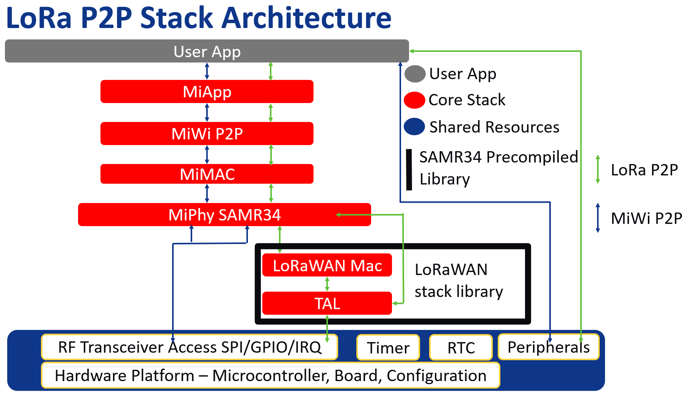
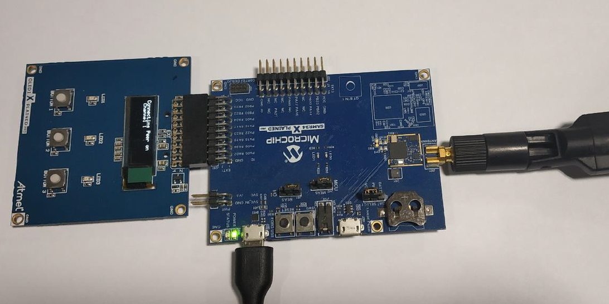
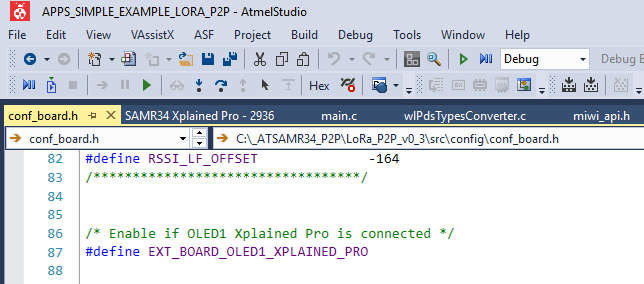
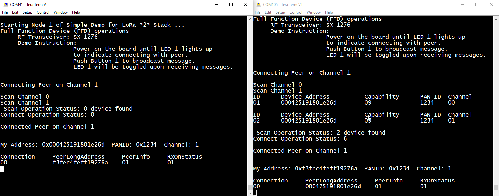
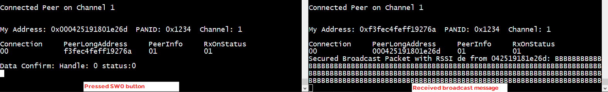
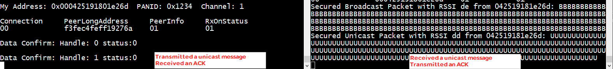
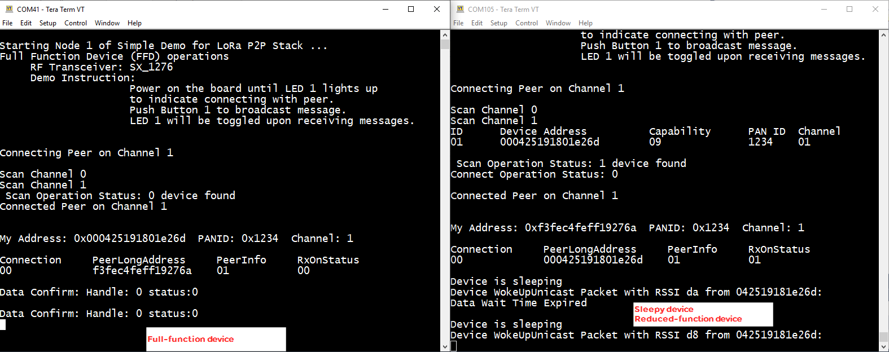
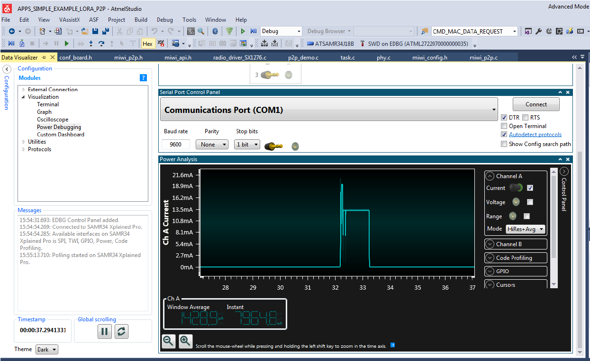

# Getting Started
> "Wireless Made Easy!" - Enable Easy to use P2P Protocol for Long-Range & Low Power Applications on SAM R34 LoRa Technology ICs and WLR089U0 Module

[Back to Main page](../README.md)

## A la carte

1. [Introduction](#step1)
1. [Overview](#step2)
1. [Supported Hardware Platforms and IDEs](#step3)
1. [Development Environment Setup](#step4)
   1. [Microchip Studio Installation](#step4a)
   1. [Stack Configurations](#step4b)
   1. [Building Applications in Microchip Studio](#step4c)
1. [Hardware Environment Setup](#step5)
1. [Out-of-box Demo Application](#step6)

## Introduction<a name="step1"></a>

This document describes prototyping, implementing, testing, and deploying wireless sensor networks using LoRa P2P Protocol based on the Microchip software platform. This document also details how to get started with the LoRa P2P by installing the development environment, setting up hardware, and programming devices with the reference application.

## Overview<a name="step2"></a>

LoRa P2P Development Environment was developed by Microchip to support a wide range of wireless applications. LoRa P2P Development Environment is based on the MiWi stack as defined by three blocks:

- Application layers (User App + MiApp)
- Protocol layers (MiWi P2P + MiMAC)
- RF transceiver layer (MiPhy SAMR34)

The three blocks are linked together by MAC and App interfaces. The Application layer uses App interfaces to communicate to the protocol layer. In the protocol layer, the LoRa P2P is implemented.

<p align="center">

</p>

> Notice the LoRa P2P MiPhy layer relies on the Transceiver Abstraction Layer (TAL) which come pre-compiled as part of the LoRaWAN stack library.

## Supported Hardware Platforms and IDEs<a name="step3"></a>

The following table lists the supported hardware platforms and IDEs for the LoRa P2P protocol.

| Device       | RF Transceiver | Supported Evaluation Kit | Supported IDEs   |
| ------------ | -------------- | ------------------------ | ---------------- |
| SAMR34J18B   | SX1276 (in SIP)| SAMR34 Xplained Pro      | Microchip Studio v7.0|
| WLR089U0     | SX1276 (in SIP)| WLR089 Xplained Pro      | Microchip Studio v7.0|

## Development Environment Setup<a name="step4"></a>

This chapter provides instructions on how to set up the LoRa P2P software package and supported IDEs. It also describes the structure of the MiWi package, and includes references to hardware setup of the supported platforms.

### Microchip Studio Installation<a name="step4a"></a>

Microchip Studio can be used to develop and debug applications for AVR- and ARM-based platforms. Microchip Studio is equipped with the GCC compiler and does not require any additional external tools to compile and debug LoRa P2P application.

Perform the following steps to install the Microchip Studio.
1. [Download](https://www.microchip.com/mplab/microchip-studio)) and install the latest Microchip Studio version, if not already installed on your PC.
2. Add path to the folder containing the ARM GCC compiler to the Path Windows environment variable. The compiler is located in the `\Atmel\Studio\7.0\toolchain\arm\arm-gnu- toolchain\arm-none-eabi\bin` directory of the Microchip Studio installation directory.\
This step is necessary for command line compilation (with makefiles).
3. Install latest ASFv3 as an extension to Microchip Studio from: **Tools -> Extensions and updates**
4. Install the Device Part Pack for developing with SAMR34/R35 or WLR089U0 from: **Tools -> Device Pack Manager -> Search for** SAMR34 and/or WLR089 and click install
5. Restart Microchip Studio 7.0 IDE

### Stack Configurations<a name="step4b"></a>

LoRa P2P uses the configuration files to regulate the behavior of the stack.

The following are the locations of header files to configure the behavior of P2P application:

```
- thirdparty\wireless\miwi\apps\simple_example_lora_p2p\miwi_config.h
- thirdparty\wireless\miwi\apps\simple_example_lora_p2p\miwi_config_p2p.h
```

Default channel (ch 1: `FREQ_863000KHZ`) is configured in the file `task.c` through the variable `myChannel`.

Refer the function `phySetChannel()` implemented in `phy.c` for further details on the frequency map for LoRa P2P application.

Default data rate setting is 5 (equivalent to Spreading Factor SF7), default bandwidth is 125 kHz and both parameters can be changed using the API `PHY_SetAttribute` implemented in `phy.c`.

By default, PA_Boost is disabled and Transmit Output Power is set to +1dBm. The API `PHY_SetTxPower` can be used to set the Tx power and the PA_Boost will be set accordingly.

### Building Applications in Microchip Studio<a name="step4c"></a>

Microchip Studio can be used to develop and build LoRa P2P application. Reference applications include Microchip Studio project files located in the `\as5_arm` subdirectory of the application root directory. These projects depend on the configurations provided by the external low-level makefiles.

Perform the following steps to open a project:
- Open Microchip Studio
- Choose **File -> Open -> Project**
- Select **APPS_SIMPLE_EXAMPLE_LORA_P2P** Application project

Perform the following steps to build the application:
- From the main menu, choose **Build -> Rebuild All**

When the build process is complete, some of the `.hex, .srec, .bin and .elf` image files are generated based on the selected platform configuration.\
Use the `.hex` file for programming the devices via EDBG. The `.elf` is used for debugging.

> It is also possible to compile the applicationby running the make utility command to build the application from **Tools -> Command Prompt**\
`make clean all`

## Hardware Environment Setup<a name="step5"></a>

The following boards can be used in LoRa P2P release:
- [SAM R34 Xplained Pro](https://www.microchip.com/DevelopmentTools/ProductDetails/dm320111)
- [WLR089U0 Module Xplained Pro](https://www.microchip.com/DevelopmentTools/ProductDetails/PartNO/EV23M25A1) for more details

[OLED1 Xplained Pro Extension Board](https://www.microchip.com/developmenttools/ProductDetails/atoled1-xpro) can be used as an additional board to show the full-featured demo.\
This board must be connected on EXT1 connector of SAMR34/SAMR34 Module XPROs.\
Check out the [OLED1 Xplained Pro User Guide](https://www.microchip.com/developmenttools/ProductDetails/atoled1-xpro) for more details.

Simply connect the micro USB cable to the **Debug EDBG USB** port of the board and connect the other end to the computer.

<p align="center">

</p>

Download and install a serial terminal program like [TeraTerm](https://osdn.net/projects/ttssh2/releases/). Launch TeraTerm program and configure the serial ports mounted with: 115200 bps, 8 N 1

## Out-of-box Demo Application<a name="step6"></a>

The simple example application code focuses on the simplicity of the LoRa P2P protocol stack application programming interfaces. It provides wireless communication between two devices with less than 30 lines of C code to run the stack in the application layer for both devices. In this application, the following features of LoRa P2P protocol stack are demonstrated:
- Establish a connection automatically between two devices
- Broadcast a packet
- Unicast a packet

To run full-featured Simple_Example_LoRa_P2P application, the user needs to connect OLED1 Xplained Pro to the main board (SAMR34 or WLR089U0 Module Xpro). When using OLED1 Xplained PRO along with SAMR34 XPRO or WLR089U0 XPRO, the user needs to enable the macro `#define EXT_BOARD_OLED1_XPLAINED_PRO` in file `conf_board.h`.
<p align="center">

</p>

To run the simple example application, perform the following instructions.

1. Program node 1 and node 2 with Simple_Example_LoRa_P2P application firmware.
2. Power on node 1 and node 2, respectively.
3. Wait for few seconds, until the first LED on both nodes are powered-up.\
This indicates that a connection is established automatically.

> For the details of connection establishment, refer to section “Variations for Handshaking” in Application Note [AN1204 Microchip MiWi™ P2P Wireless Protocol](http://ww1.microchip.com/downloads/en/DeviceDoc/00001204C.pdf) if MiWi P2P protocol is used.

If the demo is running with the **ATOLED1-XPRO** attached to the board, critical information is shown on the LCD of the demo board. It first shows the demo name, RF transceiver and node number, then connecting information and channel information is shown before the LCD shows the demo instruction.


| Text on OLED Display           | Description                               |
| ------------------------------ | ----------------------------------------- | 
| Simple P2P Demo on SAMR34 Node | Splash screen after powering ON the board |
| Connecting Peer on Channel 1   | Connecting to a network if found          |
| Connected Peer on Channel 1    | Connected to a network. This log does not show for the first device since it starts the network when it is unable to find network to join |
| SAM R34 XPRO and OLED1 XPRO SW:Broadcast, BUTTON1:Unicast | Demo instruction is displayed |

If a serial console is opened to monitor application output, the user can observe the peer device information printed out from the nodes.

<p align="center">

</p>

4. Press SW0 button on one node to toggle the LED on the other node
   - This shows how a broadcast packet is transmitted
   - If the demo is running on SAM R34 XPRO with ATOLED1-XPRO, the total number of transmitted and received messages will be shown on the display.

| Text on OLED Display           | Description                               |
| ------------------------------ | ----------------------------------------- | 
| TX Message: 0, Rx Messages: 2  | Total number of transmitted and received messages |

If a serial console is used on the receiving node (the device that has LED toggled), the user can see the printout of the broadcast packet source address, signal strength and the packet payload.

<p align="center">

</p>

5. For transmitting unicast message to a particular device an ATOLED1-XPRO is required.\
Press BUTTON1 from the extension board to select the device to send unicast message using button SW0 and the display.

<p align="center">

</p>

6. Data communication can be either secured or non-secured in the entire network. The security feature can be enabled by defining the MACRO `#define ENABLE_SECURITY` in the file `miwi_config.h`

7. The unicast direct data communication can be acknowledged communication which has the automatic retry for the failed communication. The acknowledgment timeout and the number of times the failed data shall be retried can be configured using the below defines available in `miwi_config.h`
```
#define ACK_TIMEOUT_INTERVAL 1
#define DATA_RETRY_ATTEMPT 3
```

8. To enable the sleep functionality on one of the device and become an RFD, need to include the `ENABLE_SLEEP_FEATURE` symbol in **Project Properties -> Toolchain -> ARM/GNU C Compiler -> Symbol**

The below figure shows the connection process of the sleeping functionality enabled device and the sleep / wakeup cycle along with the data polling.

<p align="center">

</p>

9. During the sleep operation, the device current consumption will be around the 8 uA for the SAM R34 XPRO and even less for the WLR089U Module XPRO.

<p align="center">

</p>

10. By default, Network Freezer is disabled in the application. To enable this functionality, need to include the `ENABLE_NETWORK_FREEZER` symbol **Project Properties -> Toolchain -> ARM/GNU C Compiler -> Symbol**.\
The Network Freezer feature is used to store critical network information into the non-volatile memory. When the device reboots or power is rebooted, it restores the persistent data from the non-volatile memory and continues to operate in the same network with the existing network information.

If the power is rebooted on a node, the following description may be used to restore the persistent data if available in the node using the Network Freezer.

After Step 1, the following message is shown on the LCD. The user must press the SW0 button within 5 seconds to boot the application from stored network parameters, or the user can press and hold the SW button immediately after power reboot till the LCD shows the following message.

| Text on OLED Display           | 
| ------------------------------ | 
| SW: Use Nwk Freezer, Press in 5 sec  |

If the SW0 button is pressed within the timeout, the application restores the data from Network Freezer and the following message is shown on LCD.

`Restoring Network !!`

<a href="#top">Back to top</a>

