# Real-life Use Case Examples
> "Wireless Made Easy!" - Enable Easy to use P2P Protocol for Long-Range & Low Power Applications on SAM R34 LoRa Technology ICs and WLR089U0 Module

[Back to Main page](../README.md)

## A la carte

1. [Introduction](#step1)
1. [Enable P2P Communication between end nodes](#step2)
   1. [Overview](#step2a)
   1. [Hardware Setup](#step2b)
   1. [Configure the Application](#step2c)
   1. [Run the demo](#step2d)
1. [Enable a Network composed of end nodes and a coordinator](#step3)
   1. [Overview](#step3a)
   1. [Hardware Setup](#step3b)
   1. [Configure the Application](#step3c)
   1. [Run the demo](#step3d)
1. [Enable Long-Range Communication](#step4)
   1. [Overview](#step4a)
   1. [Hardware Setup](#step4b)
   1. [Configure the Application](#step4c)
1. [Enable Periodic transmission](#step5)
   1. [Overview](#step5a)
   1. [Configure the Application](#step5b)
1. [Enable Regulations Features](#step6)
   1. [Overview](#step6a)
   1. [Configure the Application](#step6b)
   1. [Run the demo](#step6c)
   1. [Limitations](#step6d)

## Introduction<a name="step1"></a>

This section provides guidelines to customize the LoRa P2P reference sample code in order to allow different Peer-to-Peer network deployment and fulfill many use cases.

## Enable P2P Communication between end nodes<a name="step2"></a>

### Overview<a name="step2a"></a>

A typical P2P network is composed of two devices and that topology offers fastest, reliable and direct connection between devices. There is no need for network infrastructure. The message propagation are very limited.

<p align="center">
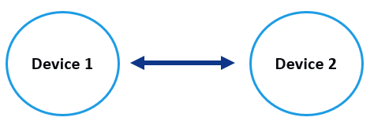
</p>

In a deployment of such simple topology, it is important that the messages exchanged between those two devices will stay in a local and private network and not be understood by another network in the same vicinity. And this is where the PAN identifier can be used to differenciate the networks.

<p align="center">
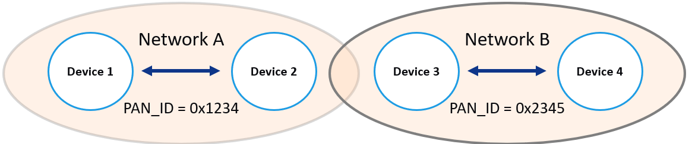
</p>

### Hardware Setup<a name="step2b"></a>

To demonstrate this scenario, minimum 4 boards are required. In a P2P network, at least one of the device must be a Full Functional Device (FFD) and the other can be either an FFD or a Reduce Functional Device (RFD).

<p align="center">
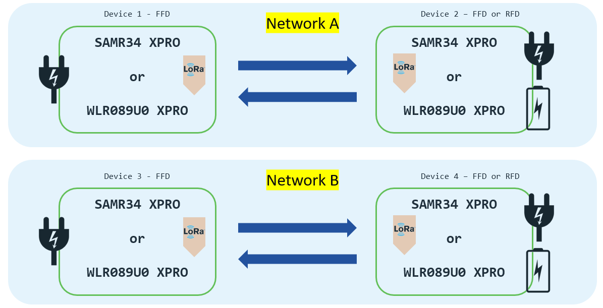
</p>

### Configure the Application<a name="step2c"></a>

- Open file `miwi_config.h` and configure devices with same PAN identifier within a network

e.g. Setting for Device 1 and Device 2

```
/*********************************************************************/
// MY_PAN_ID defines the PAN identifier. Use 0xFFFF if prefer a 
// random PAN ID.
/*********************************************************************/
#define MY_PAN_ID                       0x1234
```

e.g. Setting for Device 3 and Device 4

```
/*********************************************************************/
// MY_PAN_ID defines the PAN identifier. Use 0xFFFF if prefer a 
// random PAN ID.
/*********************************************************************/
#define MY_PAN_ID                       0x2345
```

- In `miwi_config.h`, disable the active scan for faster connection process between devices
```
/*********************************************************************/
// ENABLE_ACTIVE_SCAN will enable the device to do an active scan to 
// to detect current existing connection. 
/*********************************************************************/
//#define ENABLE_ACTIVE_SCAN
```

- In file `p2p_demo.c`, the function to process the message received at application layer check already if the message arrived is coming from the same PAN identifier or not.

```
void ReceivedDataIndication (RECEIVED_MESSAGE *ind)
{
    /*******************************************************************/
    // If a packet has been received, handle the information available
    // in rxMessage.
    /*******************************************************************/
	if ((myPANID.v[1] == ind->SourcePANID.v[1]) && (myPANID.v[0] == ind->SourcePANID.v[0]))
	{
		#if defined(ENABLE_CONSOLE)
		DemoOutput_HandleMessage();
		#endif
		DemoOutput_UpdateTxRx(TxNum, ++RxNum);
		// Toggle LED2 to indicate receiving a packet.
		LED_Toggle(LED0);
		DemoOutput_Instruction();
	}
	else
	{
		printf("Packet received from other Source PAN ID : 0x%x%x\r\n",ind->SourcePANID.v[1],ind->SourcePANID.v[0]);
	}
}
```

- Compile and program the code into the different boards


### Run the demo<a name="step2d"></a>

- Turn ON the boards sequentially and observe the boards with the same PAN identifier will connect each others

<p align="center">
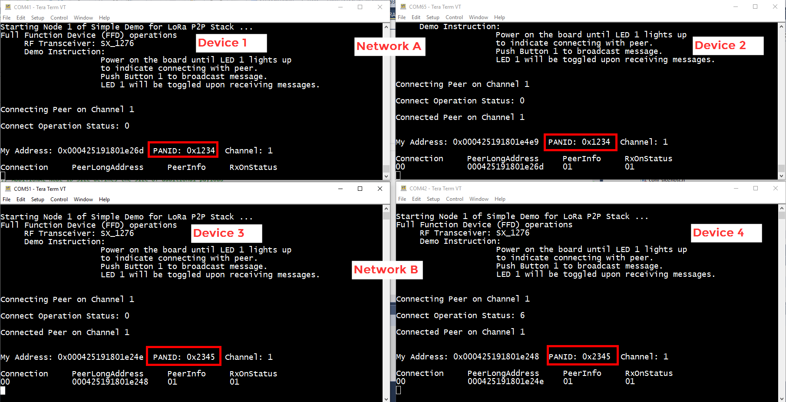
</p>

- Transmit a unicast message and check out the distribution of the message

<p align="center">

</p>

- Transmit a broadcast message and check out the distribution of the message

<p align="center">

</p>


## Enable a Network composed of end nodes and a central device<a name="step3"></a>

### Overview<a name="step3a"></a>

A typical P2P network is composed of only two devices. However with LoRa P2P protocol and thanks to the FFD and RFD device types, it is possible for multiple sleepy devices to transport their data up to a single central device.

<p align="center">
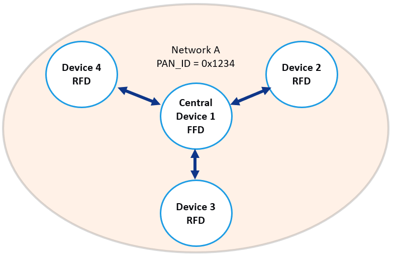
</p>

The central device creates the network and must stays enable all the time. The end-nodes join the existing network and start communicating with the central device. The FFD exposes the messages received in the same PAN id from the different RFDs.


### Hardware Setup<a name="step3b"></a>

To demonstrate this scenario, minimum 3 boards are required:
* 1 FFD
* 2 RFDs

Here, the tested setup was 3 RFDs and 1 FFD

<p align="center">
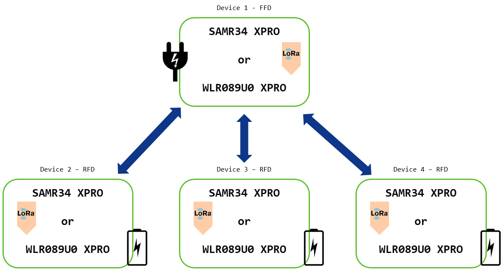
</p>

### Configure the Application<a name="step3c"></a>

- Compile and program the sample application with default configuration for the FFD Device
- Make sure the FFD starts running before the others devices in order to create the network

- For all the 3 RFDs, perform the following steps:
   - Include  the `ENABLE_SLEEP_FEATURE` symbol in **Project Properties -> Toolchain -> ARM/GNU C Compiler -> Symbol**
   - Open the file `p2p_demo.c` and go to line 190
   - Instead of waking-up the device and sending a Data Request to parent device, let's modify the code to transmit an application payload periodically to FFD
   - Set the power state mode to `POWER_STATE_WAKEUP`.
   ```
  uint8_t power_state_mode = POWER_STATE_WAKEUP ;
   ```
   - With the above configuration, the application will wake up and transmit application payload every `RFD_WAKEUP_INTERVAL`
   - Open file `miwi_config.h` and configure all devices with same PAN identifier
   - Change `RFD_WAKEUP_INTERVAL` in `miwi_config.h` if required
   - Compile and program the code into the different RFD boards

### Run the demo<a name="step3d"></a>

- Turn ON the boards sequentially (start by the FFD)
- Observe the RFDs to perform the cycle: sleep - wakeup - transmit to parent every `RFD_WAKEUP_INTERVAL` and FFD to expose the received data
 
 <p align="center">
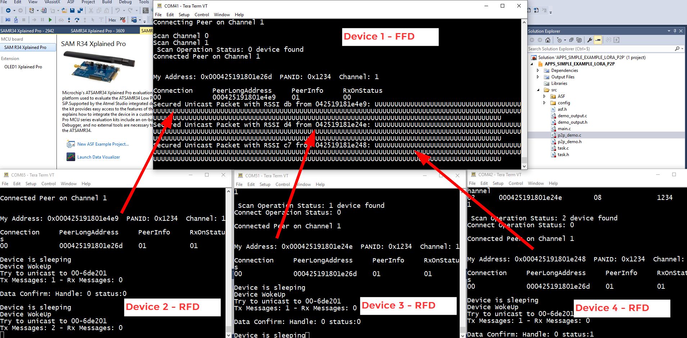
</p>

## Enable Long-Range Communication<a name="step4"></a>

### Overview<a name="step4a"></a>

The SAMR34 Xplained Pro and the WLR089U0 Module Xplained Pro boards have been designed and optimized to support 868 and 915 MHz bands. WLR089U0 module is based on the ATSAMR34J18 IC.

 <p align="center">

</p>

And both boards contain two essential components for the radio communication:
- A 32 MHz TCXO (Temperature Compensated Crystal Oscillator) which is used to clock the internal RF part. This TCXO helps in reducing the variation in the central frequency due to temperature and thus improve the receiver sensitivity.
- An RF Switch.

<p align="center">
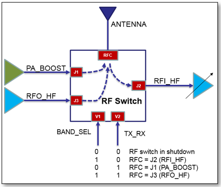
</p>

The RF Switch is used to route high frequency signals through transmission path according to the V1 and V2 signals. The Xplained Pro boards support 868 MHz and 915 MHz bands and either PA_BOOST signal (high power) or RFO_HF signal (high efficiency transmitter limited to +13dBm) can be routed to the antenna. The Rx path is common for the two bands. The TX_RX signal is automatically controlled by the SAMR34’s transceiver. When transceiver is transmitting, it will drive TX_RX signal to 1 and for receive state, it will drive TX_RX signal to 0.\
Fore more details, check out the [WLR089U0 (SAMR34 Module) Reference Design Package](https://www.microchip.com/wwwproducts/en/WLR089U0) or the [SAMR34 IC Reference Design Package](https://www.microchip.com/wwwproducts/en/ATSAMR34J18).

To fully benefit from the LoRa Modulation and achieve longer range on SAMR34 device, several factors should be taken into consideration:
- Antenna performance
- Device positioning
- Surrounding environment
- Radio transceiver configuration (Tx power mode, ...)

Another points to consider are the different regional spectrum allocations and regulatory requirements. These include allowed frequencies in a particular region and maximum output power.\
e.g. up to +14dBm output power allowed by ETSI in Europe in the 867-869 MHz band\
e.g. +20dBm output power is possible in North America in the 902-928 MHz band

The [LoRa Modem Calculator Tool](https://www.semtech.com/uploads/documents/SX1272LoRaCalculatorSetup1_1.zip) is a useful tool to get a good estimation of the critical factors like time on air per frame, equivalent bitrate, RF performance characteristics and power consumption.

Following are the most important range determinants.
- Spreading Factor\
LoRa modulation converts symbols (binary data) to chirp signals that span the frequency range. The chirp time (symbol time) is roughly proportional to 2<sup>spreading factor</sup>. Each step up in spreading factor doubles the time on air to transmit a symbol. Each unit increase in SF correlates to about 2.5dB extra link budget. Higher spreading factors are more resistant to local noise effects and will be read more reliably at the cost of lower data rate and more congestion.

- Bandwidth\
Higher bandwidth has higher data rates and is more power-efficient, but has more congestion and less range. Each doubling of the bandwidth correlates to almost 3dB less link budget.

- Link Budget: this is how many dBs you can lose between the transmit PA and the receiver IF. Higher link budget directly translate to longer distance (6dB = twice distance).

From software standpoint, the way to get the longest range is by maximizing the link budget. The hardware way includes better antenna and more power.

It is possible to maximize the link budget by:
- lowest possible bandwith
- highest possible Spreading Factor

Unfortunately decreasing the bandwidth increases the risk of miscommunication due to frequency drift and inaccuracy. These settings also affect the data rate.

Effective Data Rate:\
The relationship between these settings and data rate is approximately:
Data Rate = Bandwidth / (2<sup>SF</sup>)

It is a trade-off to find according to the need of the end-application.

### Hardware Setup<a name="step4b"></a>

Ensure the antenna orientation is the same as below to get a good range.

<p align="center">
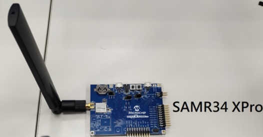
</p>

Check out the [SAMR34 Xpro and SAMR34 module (WLR089U) range measurement info](https://microchip.wikidot.com/lora:range-test-comparison-between-samr34-and-wlr089u) for more details.

### Configure the Application<a name="step4c"></a>

Following are the LoRa P2P APIs located in `phy.c` which can be used to set the SAM R34 or WLR089U0 devices for maximum possible range.

#### Set max. Output Power

- API: `void PHY_SetTxPower(uint8_t txPower)`
- Settings for Europe: `PHY_SetTxPower(15)`
- Settings for North America: `PHY_SetTxPower(20)`

> PA boost is enabled if power is higher than 15. Check out the details of the API in the code.

#### Set Spreading Factor - SF12

- API: `RadioError_t PHY_SetAttribute(RadioAttribute_t RadioAttr,uint8_t* AttrVal)`
- Set SF12:\
`RadioDataRate_t sf = SF_12;`<br>
`PHY_SetAttribute(SPREADING_FACTOR, (void *)&sf);`

#### Get Spreading Factor

- API: `RadioError_t PHY_GetAttribute(RadioAttribute_t RadioAttr,uint8_t* AttrVal)`
- `RadioDataRate_t sf;`<br>
`PHY_GetAttribute(SPREADING_FACTOR, (void *)&sf);`

#### Set Bandwidth

- API: `RadioError_t PHY_SetAttribute(RadioAttribute_t RadioAttr,uint8_t* AttrVal)`
- BW_125kHz:\
`RadioLoRaBandWidth_t bw = BW_125KHZ;`<br>
`PHY_SetAttribute(BANDWIDTH, (void *)&bw);`

#### Get Bandwidth

- API: `RadioError_t PHY_GetAttribute(RadioAttribute_t RadioAttr,uint8_t* AttrVal)`
- `RadioLoRaBandWidth_t bw;`<br>
`PHY_GetAttribute(BANDWIDTH, (void *)&bw);`


#### Code snippet example
```
MiApp_ProtocolInit(NULL, NULL);

// set RF parameters just after protocol initialization

// Read and print spreading factor
RadioDataRate_t sf ;
PHY_GetAttribute(SPREADING_FACTOR, (void *)&sf) ;
printf("Current SF: SF%d\r\n", sf) ;

// Read and print bandwidth
RadioLoRaBandWidth_t bw ;
PHY_GetAttribute(BANDWIDTH, (void *)&bw) ;
printf("Current BW: (125kHz=7, 250kHz=8, 500kHz=9) %d\r\n", bw) ;

// Modify SF
sf = SF_12 ;
RadioError_t ret ;
ret = PHY_SetAttribute(SPREADING_FACTOR, (void *)&sf) ;
if (ret == ERR_NONE)
{
   printf("Successfully set attribute to SF%d\r\n", sf) ;
}
else
{
   printf("Error to write SF (error %d)\r\n", ret) ;
}

// Read back SF
PHY_GetAttribute(SPREADING_FACTOR, (void *)&sf) ;
printf("Current SF %d", sf) ;
```

## Enable Periodic transmission<a name="step5"></a>

### Overview<a name="step5a"></a>

Enable periodic transmission for Full-functional device.

### Configure the Application<a name="step5b"></a>

- Set  the `PERIODIC_TX` symbol in **Project Properties -> Toolchain -> ARM/GNU C Compiler -> Symbol**

- Open file `task.h` and set the desired interval

```
#define INITIAL_DATA_SENDING_INTERVAL_MS	2000
#define DATA_SENDING_INTERVAL_MS			   20000
```

- Open file `p2p_demo.c` to find the data to transmit

```
/* Payload size for data sent out using periodic transmission */
#define PAYLOAD_SIZE 40		// stay below MAX_SEC_UCAST_PAYLOAD
/* Payload for data sent out using periodic transmission */
#define PAYLOAD      "HelloWorldHelloWorldHelloWorldHelloWorld"
```

## Enable Regulations Features<a name="step6"></a>

### Overview<a name="step6a"></a>

**LoRa P2P is operating with a single frequency channel.**

#### **FCC Regulations**

There are no duty cycle limitations imposed by the FCC but there is a 400 ms max dwell time per channel. Dwell time is occupancy limit for frequency hopping radio technics only. Frequency hopping is not implemented in LoRa P2P. In LoRa modulation using single channel in a bandwidth of 125kHz with no frequency hopping mechanism, to be compliant we FCC regulations, the LoRa P2P protocol must bound by the 500 kHz bandwidth with a limitation of 1W (+30 dBm).

> References:
> - https://www.law.cornell.edu/cfr/text/47/15.247
> - https://www.govinfo.gov/content/pkg/CFR-2010-title47-vol1/pdf/CFR-2010-title47-vol1-sec15-247.pdf
>
> (2) Systems using digital modulation techniques may operate in the 902-928 MHz, 2400-2483.5 MHz, and 5725-5850 MHz bands. The minimum 6 dB bandwidth shall be at least 500 kHz.\
(i) For frequency hopping systems operating in the 902-928 MHz band: if the 20 dB bandwidth of the hopping channel is less than 250 kHz, the system shall use at least 50 hopping frequencies and the average time of occupancy on any frequency shall not be greater than 0.4 seconds within a 20 second period; if the 20 dB bandwidth of the hopping channel is 250 kHz or greater, the system shall use at least 25 hopping frequencies and the average time of occupancy on any frequency shall not be greater than 0.4 seconds within a 10 second period. The maximum allowed 20 dB bandwidth of the hopping channel is 500 kHz.

<br>

#### **Duty Cycling**

The duty cycling is a limitation in the Sub-GHz band. Duty cycle is defined as the ratio, expressed as a percentage, of a maximum transmitter "on" time within a 1 hour period.

Europe (863-870 MHz frequency band), Russia (864-870MHz band) and Asia (923 MHz band) are regions where duty cycle regulation is applied.

For Europe region, the ETSI regulation allows the choice of using either a duty-cycle limitation mechanism or a polite spectrum access. The polite spectrum access encompasses 2 aspects: Listen Before Talk (LBT) and Adaptive Frequency Agility (AFA). In case polite spectrum access is available, then the duty cycle requirement need NOT be met.

The duty cycle of radio devices is often regulated by government. Depending of the region and the frequency radio band, but the duty cycle value can be 0.1%, 1% or 10%.

In Europe, duty cycles are regulated in the [ETSI EN 300 220-2 v3.2.1 (2018-06) standard](https://www.etsi.org/deliver/etsi_en/300200_300299/30022002/03.02.01_60/en_30022002v030201p.pdf). This standards defines the following sub-bands and their duty cycle values:

<p align="center">
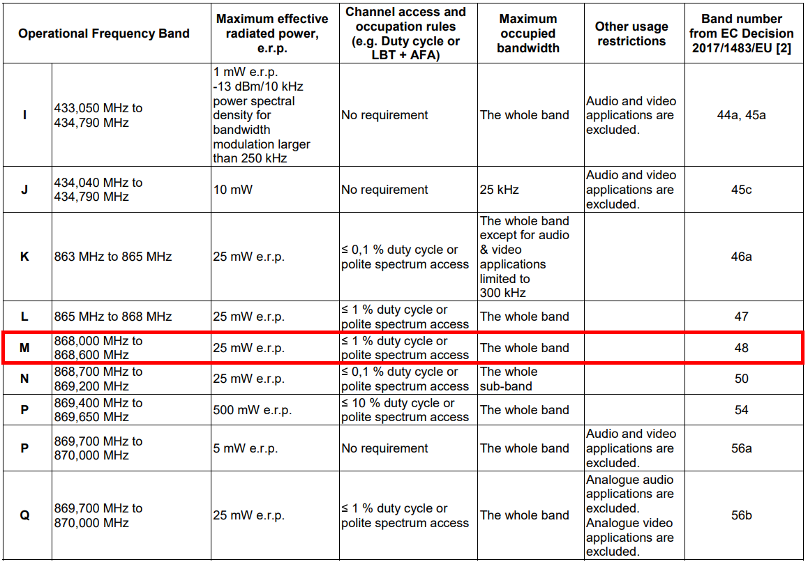
</p>

- g (863.0 – 868.0 MHz): 1% 25mW (14dBm)
- g1 (868.0 – 868.6 MHz): 1% 25mW (14dBm)
- g2 (868.7 – 869.2 MHz): 0.1% 25mW (14dBm)
- g3 (869.4 – 869.65 MHz): 10% 500mW (27dBm)
- g4 (869.7 – 870.0 MHz): 1% 25mW (14dBm)

To match the local regulations, the end device transmit duty-cycle SHALL be lower than the x% of a particular sub-band. That means the end device cannot occupy the selected band more than a certain amount of time. The duty-cycle is also here to avoid network congestion.

Every radio device must comply with the regulated duty cycle limits. The duty cycle at the operating frequency shall not be greater than regulated values for the chosen operational frequency band. And this is true either the radio is using frequency hopping mechanism or not.

The [WLR089U0 Module](https://www.microchip.com/wwwproducts/en/WLR089U0) has been certified using duty cycle test procedure in the limit of 1% for the 868.5 MHz frequency. The cumulative transmissions time for the device cannot exceed 36 seconds within an hour. The device does not support polite spectrum access function.\
Checkout the [EN 300 220 Test report](https://ww1.microchip.com/downloads/en/DeviceDoc/WLR089U0_Module_Regulatory_Approval_Document_RevB.zip).

That is the motivation to enable a simple duty cycling implementation to the LoRa P2P application code.

### Configure the Application<a name="step6b"></a>

#### Set the Bandwidth

Set RF parameters just after protocol initialization

```
MiApp_ProtocolInit(NULL, NULL) ;
// Read and print bandwidth
RadioLoRaBandWidth_t bw ;
PHY_GetAttribute(BANDWIDTH, (void *)&bw) ;
printf("Current BW (125kHz=7, 250kHz=8, 500kHz=9): %d\r\n", bw) ;
// Set the desired bandwidth (e.g.: 125 kHz)
bw = BW_125KHZ ;
PHY_SetAttribute(BANDWIDTH, (void *)&bw) ;
```

#### Set the operational frequency

Make sure to disable the energy scan features in `miwi_config.h`
```
/*********************************************************************/
// ENABLE_ED_SCAN will enable the device to do an energy detection scan
// to find out the channel with least noise and operate on that channel
/*********************************************************************/
//#define ENABLE_ED_SCAN
```

Set the desired channel in `task.c` populating the variable `myChannel`:
```
uint8_t myChannel = 5 ;
```

The application is setting the channel when calling the API `MiApp_Set(CHANNEL, &myChannel)`.

Then, the function `phySetChannel()` is called to set the frequency for radio operations according to the value of the channel.

| Channel | 0 | 1 | 2 | 3 | 4 | 5 | 6 | 7 | 8 | 9 | 10 | 11 | 12 | 13 | 14 | 15 | 16 | 17 | 18 | 19 | 20 | 21 | 22 | 23 | 24 | 25 |
| ------- | - | - | - | - | - | - | - | - | - | - | - | - | - | - | - | - | - | - | - | - | - | - | - | - | - | - |
| Frequency (MHz) | 862 | 863 | 865 | 866.55 | 867 | 868.1 | 869.525 | 870 | 902.3 | 903 | 915 | 915.2 | 915.9 | 920 | 920.9 | 921.9 | 922 | 922.1 | 923 | 923.2 | 923.3 | 925 | 927.5 | 928 | 928.5 | 1020 |

#### Enable Duty Cycling

- Set  the `DUTY_CYCLING` symbol in **Project Properties -> Toolchain -> ARM/GNU C Compiler -> Symbol**

- For the channel selected, duty cycling percentage is configured in `p2p_demo.c`
```
/* Duty cycling percentage - range : 1 to 99 */
#define dutyCyclePercentage				1
```

### Run the demo<a name="step6c"></a>

- When connected to a pan coordinator, issue a broadcast or unicast transmission from the end device with duty cycling enabled

- If there is no remaining duty cycling duration to wait, the payload is transmitted to the parent device (the application stores the size of the payload to transmit)

- In the transmission callback handler `dataConfcb`, the applications starts by caculating the time on air according to the size of the payload transmitted
- Then the duty cycling duration is calculated with:\
`dutyCyclingDurationMilliSec = ((100 - dutyCyclePercentage) * (timeOnAirMilliSec * txCount))` where `txCount` value is one frame if the packet was acknowledged successfully
- The duty cycling timer is started to authorize new transmission after `dutyCyclingDurationMilliSec` (here: 33957 ms)
- If a new transmission is requested prior the duty cycling timer expiration, `NO_FREE_CH` indication is displayed and no message is leaving from the device

<p align="center">
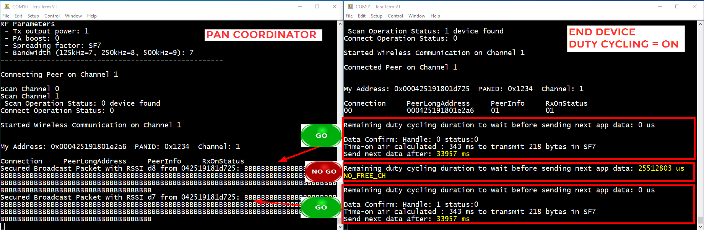
</p>

### Limitations<a name="step6d"></a>

- In this sample application, Duty cycling has been implemented for the End Device role only
- Duty cycling is performed on applicative payload transmission from end-device to coordinator
- Duty cycling is not implemented for ACK packets
- Time on air calculation API: `calculate_ToA()` (defined in file `miwi_p2p.c`) which is based on payload size has been tested with EU868 channel plan, SF = 7 to 12 and BW = 125 kHz

<a href="#top">Back to top</a>

