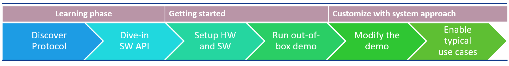

# ATSAMR34_LONG_RANGE_P2P
> "Wireless Made Easy!" - Enable Easy to use P2P Protocol for Long-Range & Low Power Applications on SAM R34 LoRa Technology ICs and WLR089U0 Module

Devices: | **ATSAMR34 | WLR089U0**

<!--

-->

## ⚠ Disclaimer

<b>
Subject to your compliance with these terms, you may use Microchip software and any derivatives exclusively with Microchip products. It is your responsibility to comply with third party license terms applicable to your use of third party software (including open source software) that may accompany Microchip software. 
THIS SOFTWARE IS SUPPLIED BY MICROCHIP "AS IS". NO WARRANTIES, WHETHER EXPRESS, IMPLIED OR STATUTORY, APPLY TO THIS SOFTWARE, INCLUDING ANY IMPLIED WARRANTIES OF NON-INFRINGEMENT, MERCHANTABILITY, AND FITNESS FOR A PARTICULAR PURPOSE. 
IN NO EVENT WILL MICROCHIP BE LIABLE FOR ANY INDIRECT, SPECIAL, PUNITIVE, INCIDENTAL OR CONSEQUENTIAL LOSS, DAMAGE, COST OR EXPENSE OF ANY KIND WHATSOEVER RELATED TO THE SOFTWARE, HOWEVER CAUSED, EVEN IF MICROCHIP HAS BEEN ADVISED OF THE POSSIBILITY OR THE DAMAGES ARE FORESEEABLE. TO THE FULLEST EXTENT ALLOWED BY LAW, MICROCHIP'S TOTAL LIABILITY ON ALL CLAIMS IN ANY WAY RELATED TO THIS SOFTWARE WILL NOT EXCEED THE AMOUNT OF FEES, IF ANY, THAT YOU HAVE PAID DIRECTLY TO MICROCHIP FOR THIS SOFTWARE.

</b>

> Interact with your peers about this software in [LoRa Forum](https://www.microchip.com/forums/f512.aspx).

## Abstract

Start from navigating in the resources available then take a deep breath and dive-in the details of the LoRa P2P Protocol and the APIs available exclusively for SAM R34 LoRa Technology ICs and WLR089U0 Module. Get two evaluation boards, setup your software environment and enjoy the Out-of-box demo capable of establishing a wireless communication between two devices with less than 30 lines of C code to run the stack in the application layer. Then customize the reference sample code and enable application to fulfill typical real-life use case examples.

<!-- Continue the LoRa P2P experience with a sample application already developped to create a network of multiple nodes and monitor the data thru a Wi-Fi connection.-->

## Resources

- [SAMR34/35 and WLR089U Landing page](https://www.microchip.com/design-centers/wireless-connectivity/low-power-wide-area-networks/lora-technology/sam-r34-r35)
- [SAMR34 Device page](https://www.microchip.com/wwwproducts/en/ATSAMR34J18)
- [SAMR34 Xplained Pro Evaluation Kit](https://www.microchip.com/DevelopmentTools/ProductDetails/dm320111)
- [WLR089U0 Module page](https://www.microchip.com/wwwproducts/en/WLR089U0)
- [WLR089U0 Module Xplained Pro Evaluation Kit](https://www.microchip.com/EV23M25A)
- [Atmel Studio 7.0 IDE](https://www.microchip.com/mplab/avr-support/atmel-studio-7)

## Sample Applications

[Clone/Download](https://docs.github.com/en/free-pro-team@latest/github/creating-cloning-and-archiving-repositories/cloning-a-repository) the current repo to get the software.

## A la carte

1. [Learning Phase](01_learning_phase/README.md#top)
   1. [Introduction](01_learning_phase/README.md#step1)
   1. [Protocol Overview](01_learning_phase/README.md#step2)
      1. [Protocol Features](01_learning_phase/README.md#step2a)
      1. [Protocol Considerations](01_learning_phase/README.md#step2b)
   1. [Acronyms and Abbreviations](01_learning_phase/README.md#step3)
   1. [Architecture](01_learning_phase/README.md#step4)
   1. [LoRa P2P Wireless Protocol](01_learning_phase/README.md#step5)
      1. [PHY Layer](01_learning_phase/README.md#step5a)
      1. [Device Types](01_learning_phase/README.md#step5b)
      1. [Supported Topology](01_learning_phase/README.md#step5c)
      1. [Network Types](01_learning_phase/README.md#step5d)
      1. [Network Addressing](01_learning_phase/README.md#step5e)
   1. [Message Format](01_learning_phase/README.md#step6)
      1. [Frame Format](01_learning_phase/README.md#step6a)
      1. [Transmitting and Receiving](01_learning_phase/README.md#step6b)
   1. [Variations for Handshaking](01_learning_phase/README.md#step7)
   1. [Custom MAC Commands for LoRa P2P Wireless Protocol](01_learning_phase/README.md#step8)
      1. [P2P Connection Request](01_learning_phase/README.md#step8a)
      1. [P2P Connection Removal Request](01_learning_phase/README.md#step8b)
      1. [Data Request](01_learning_phase/README.md#step8c)
      1. [P2P Connection Response](01_learning_phase/README.md#step8d)
      1. [P2P Connection Removal Response](01_learning_phase/README.md#step8e)
   1. [LoRa P2P Wireless Protocol's Unique Features](01_learning_phase/README.md#step9)
   1. [Network Freezer](01_learning_phase/README.md#step10)
      1. [Motivation](01_learning_phase/README.md#step10a)
      1. [Solution](01_learning_phase/README.md#step10b)
      1. [Interface](01_learning_phase/README.md#step10c)
      1. [Additional Notes](01_learning_phase/README.md#step10d)
   1. [Sleep Feature](01_learning_phase/README.md#step11)
   1. [LoRa P2P - Networking](01_learning_phase/README.md#step12)
      1. [Start and Join Network](01_learning_phase/README.md#step12a)
      1. [Data Transfer in Network](01_learning_phase/README.md#step12b)
   1. [MACRO Description for LoRa P2P](01_learning_phase/README.md#step13)
   1. [MiApp API List](01_learning_phase/README.md#step14)
   1. [MiApp API Description](01_learning_phase/README.md#step15)
   1. [Limitations](01_learning_phase/README.md#step16)

1. [Getting Started](02_getting_started/README.md#top)
   1. [Introduction](02_getting_started/README.md#step1)
   1. [Overview](02_getting_started/README.md#step2)
   1. [Supported Hardware Platforms and IDEs](02_getting_started/README.md#step3)
   1. [Development Envrionment Setup](02_getting_started/README.md#step4)
      1. [Atmel Studio Installation](02_getting_started/README.md#step4a)
      1. [Stack Configurations](02_getting_started/README.md#step4b)
      1. [Building Applications in Atmel Studio](02_getting_started/README.md#step4c)
   1. [Hardware Environment Setup](02_getting_started/README.md#step5)
   1. [Out-of-box Demo Application](02_getting_started/README.md#step6)

1. [Customize with system approach](03_customize/README.md#top)
   1. [Introduction](03_customize/README.md#step1)
   1. [Enable P2P Communication between end nodes](03_customize/README.md#step2)
      1. [Overview](03_customize/README.md#step2a)
      1. [Hardware Setup](03_customize/README.md#step2b)
      1. [Configure the Reference Code Example](03_customize/README.md#step2c)
      1. [Run the demo](03_customize/README.md#step2d)
   1. [Enable a Network of end nodes and a single coordinator](03_customize/README.md#step3)
      1. [Overview](03_customize/README.md#step3a)
      1. [Hardware Setup](03_customize/README.md#step3b)
      1. [Configure the Reference Code Example](03_customize/README.md#step3c)
      1. [Run the demo](03_customize/README.md#step3d)
   1. [Enable Long-Range Communication](03_customize/README.md#step4)
      1. [Overview](03_customize/README.md#step4a)
      1. [Hardware Setup](03_customize/README.md#step4b)
      1. [Configure the Application](03_customize/README.md#step4c)

